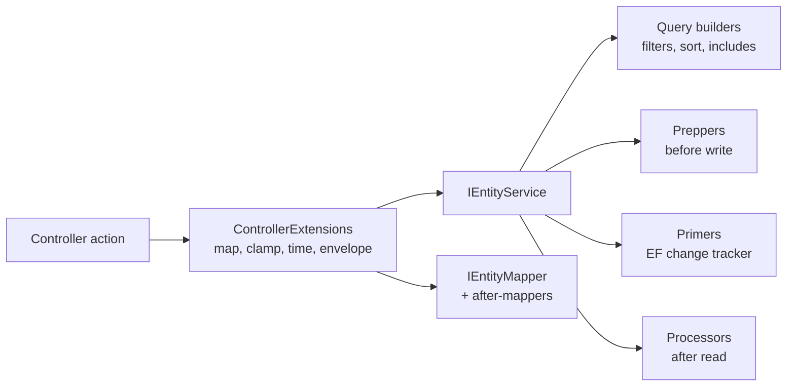

# Mediator pattern for Regira Entities Web

As of 2026-09-21. Source of every claim on this page: the `Regira-Packages` repository, branch `wip`, as read on that date.

## Recommendation

A mediator can take over what the controllers *do* with little disruption, because the controllers are already one-line adapters. Replacing the controllers as the HTTP surface is a separate and much larger step with real binding and link-generation risks.

The proposal, in order:

1. Extract the orchestration in `ControllerExtensions` into HTTP-neutral request handlers, one per operation (details, list, search, save, patch, delete).
2. Dispatch them through a small in-house sender with pipeline behaviours. No third-party mediator library.
3. Register the closed handlers from `For<>()`, where every type argument is already known.
4. Keep `EntityControllerBase` and its seven overloads as adapters that build a request and call the sender. Routes, arity contract, filters, validator, docs and tests stay unchanged. This is a minor version of `Regira.Entities.Web`.
5. Optionally, add a registration-driven minimal-API surface beside the controllers. That step removes the N+2 generic subclass per entity and the arity-mismatch class of bugs, at the cost of the work items listed below.

What a mediator does **not** buy here: per-entity pre- and post-processing. Preppers, processors, primers, query builders and the wrapping service base already cover that below the controller.

## What the controllers are today

The controller bases declare routes and nothing else. Every action in `EntityControllerBase` is a one-line forward to a static helper on `ControllerBase`, and all orchestration lives in `ControllerExtensions` under `src/Entities.Web/Controllers/`.

| Piece | Where it lives | What it does | MVC-bound? |
| --- | --- | --- | --- |
| `EntityControllerBase<>` (7 overloads, simple 5-arity and complex 7-arity) | `Controllers/Abstractions/EntityControllerBase.cs` | Route attributes, `virtual` actions, `?? NotFound()` | Yes |
| `ControllerExtensions` | `Controllers/ControllerExtensions.cs` | Resolve service and mapper, clamp paging, stopwatch, map DTO, wrap envelope, catch the three entity exceptions | Yes, through four seams (below) |
| `EntitySaveHelper` | `EntitySaveHelper.cs` | Archived-inclusive existence check, `IsArchived` preservation, refetch-after-save policy | No, documented as reusable by any HTTP surface |
| `ApplyPagingDefaults` | `Regira.Entities`, `Models/EntityListOptionsExtensions.cs` | Default and max page size clamp | No |
| Result records (`DetailsResult`, `ListResult`, `SearchResult`, `SaveResult`, `DeleteResult`, `CountResult`) | `Models/` | Response envelopes | No |
| `EntityExceptionFilter` and `EntityConstraintConflictAttribute` | `Controllers/` | `EntityInputException` to 400, constraint and concurrency exceptions to 409, application-wide | Yes |
| `ControllerRegistrationValidator` | `Validation/` | Startup check that each controller's generics have a matching `IEntityService<>` registration | Yes, reflects over `ApplicationPartManager` |
| `AttachmentUriResolver<>` | `Attachments/Services/` | Builds the download link for attachment DTOs | Yes, `GetUriByAction` with the controller name derived from the attachment type name |
| `EntityAttachmentControllerBase<>` and `AttachmentControllerBase` | `Attachments/Abstractions/` | Upload, replace, download, list attachments | Yes, `IFormFile`, `[FromForm]`, `this.File()` from `Regira.Web` |

**The four seams that bind the helpers to MVC.** Everything else in the helpers is plain C# over `IEntityService` and `IEntityMapper`.

1. Service resolution through `HttpContext.RequestServices` instead of constructor injection. This is deliberate: consumer subclasses have no constructor to keep compatible.
2. Errors expressed as `ModelState`, `BadRequest(ModelState)` and `Conflict(problem)`.
3. PATCH reads `Request.Body` directly and takes the serializer options from the MVC `JsonOptions`.
4. PATCH validates the merged input with `TryValidateModel`.

The catch blocks in the Save and Delete helpers are already redundant in a host that called `ConfigureDefaultJsonOptions()`, because that call registers `EntityExceptionFilter` application-wide. The filter exists so hand-written domain actions answer a rule breach the same way the generated actions do.

**What consumers build on top of the controller shape.** These are the extension points a redesign has to keep working, taken from the guides in `src/Common.Entities/ai/`.

- A subclass with N+2 generic arguments mirroring the `For<>()` registration. A wrong arity compiles and fails at startup validation. A Roslyn analyzer for this alignment is an open framework ask in `ai/learnings.md`.
- Overriding a `virtual` action, for example `[AllowAnonymous]` on `GetFile` for public downloads.
- A second controller on the same route for domain actions, answering with `this.Details<TEntity, TDto>(id)` from `Regira.Entities.Web.Controllers`.
- A global `IAsyncActionFilter` that keys write authorization on the `controller` route value and the action's route template.
- `RoutePrefixConvention`, an `IApplicationModelConvention`, to put every controller under a configurable base path.
- `MapControllers().RequireAuthorization()` as the documented way to secure the generated endpoints.
- Complex `[FromQuery] TSearchObject` binding, `AddNewtonsoftJson` in the test API, and `IFormFile` with `[FromForm] TInputDto` on uploads.

## A dispatcher already exists below the controller

`IEntityService` with its extension points is already a per-entity command and query pipeline. A mediator would be a second dispatcher for the same six operations, so its value has to come from the layer above the service, not from replacing it.



The controller extension box is the only layer with no abstraction of its own. It is where a mediator's request and handler belong.

| Concern | Handled today by | Would a mediator add anything? |
| --- | --- | --- |
| Per-entity logic before a write | Preppers, primers, `[ServerOwned]` | No |
| Per-entity logic after a read | Processors, after-mappers | No |
| Row security and filtering | Global and filtered query builders | No |
| Replacing a service method for one entity | `EntityWrappingServiceBase` decorator | No |
| Orchestration without a fake `HttpContext` in unit tests | Nothing; the helpers need `ControllerBase` | Yes |
| Replacing one operation for one entity without subclassing a controller | Overriding a `virtual` action | Yes, a closed handler registration |
| Cross-cutting behaviour at the operation level (timing, list caching, audit of writes) | Stopwatch inline; otherwise MVC filters | Yes, pipeline behaviours |
| One implementation feeding two HTTP surfaces | Nothing; a minimal-API surface would duplicate the helpers | Yes |

The last four rows are the case for the pattern. The first four are why it should stay above `IEntityService` and never wrap it.

## Recommended design

Four steps, each shippable on its own. Steps 1 to 4 change no route, envelope or consumer signature.

### Step 1: HTTP-neutral requests and handlers

A new namespace `Regira.Entities.Web.Operations` with no ASP.NET Core types, so it can move to a lower package later. One record per operation, carrying the same type arguments the helpers take today.

```csharp
public interface IEntityRequest<TResponse>;

public sealed record DetailsQuery<TEntity, TKey, TDto>(TKey Id, ArchivedFilter? Archived = null)
    : IEntityRequest<DetailsResult<TDto>>;
public sealed record ListQuery<TEntity, TKey, TSo, TSortBy, TIncludes, TDto>(
    IList<TSo?> SearchObjects, PagingInfo? Paging, TIncludes[] Includes, TSortBy[] SortBy)
    : IEntityRequest<ListResult<TDto>>;
public sealed record SearchQuery<TEntity, TKey, TSo, TSortBy, TIncludes, TDto>(
    IList<TSo?> SearchObjects, PagingInfo? Paging, TIncludes[] Includes, TSortBy[] SortBy)
    : IEntityRequest<SearchResult<TDto>>;
public sealed record SaveCommand<TEntity, TKey, TDto, TInputDto>(TInputDto Input, TKey? Id = default)
    : IEntityRequest<SaveResult<TDto>>;
public sealed record PatchCommand<TEntity, TKey, TDto, TInputDto>(TKey Id, JsonElement Patch)
    : IEntityRequest<SaveResult<TDto>>;
public sealed record DeleteCommand<TEntity, TKey, TDto>(TKey Id)
    : IEntityRequest<DeleteResult<TDto>>;

public interface IEntityRequestHandler<in TRequest, TResponse>
    where TRequest : IEntityRequest<TResponse>
{
    // null = not found. EntityInputException, EntityConstraintException and
    // EntityConcurrencyException propagate to the host's exception mapping.
    Task<TResponse?> Handle(TRequest request, CancellationToken token = default);
}

public delegate Task<TResponse?> EntityRequestDelegate<TResponse>();

public interface IEntityPipelineBehavior<in TRequest, TResponse>
    where TRequest : IEntityRequest<TResponse>
{
    Task<TResponse?> Handle(TRequest request, EntityRequestDelegate<TResponse> next, CancellationToken token = default);
}

public interface IEntitySender
{
    Task<TResponse?> Send<TResponse>(IEntityRequest<TResponse> request, CancellationToken token = default);
}
```

Design decisions inside the handlers:

- **Not found is `null`, errors are exceptions.** This matches how `IEntityService` behaves today, so a consumer calling the sender from a job or a seeder gets the same contract. Status mapping stays in `EntityExceptionFilter` for MVC and becomes an `IExceptionHandler` for minimal APIs. The catch blocks in the current Save and Delete helpers go away.
- **The simple list and search shapes are the complex ones with empty arrays.** One handler per operation, resolved against `IEntityService<TEntity, TKey>` when `TSortBy` and `TIncludes` are the built-in defaults. This mirrors how the simple controller bases chain to the complex ones today.
- **PATCH takes a `JsonElement` and `JsonSerializerOptions`.** Reading the body and picking the options belongs to the endpoint. The merge logic in `ApplyJsonMergePatch` moves over unchanged.
- **DataAnnotations validation is a pipeline behaviour** on `SaveCommand` and `PatchCommand`, using `Validator.TryValidateObject`, so MVC and minimal APIs share it. MVC's automatic 400 for the plain `PUT` body keeps running in front of it.
- **Timing is a pipeline behaviour** that fills `Duration` on every result, replacing the stopwatch repeated in each helper.
- `EntitySaveHelper` is called from the handlers as it is called from the helpers now.

### Step 2: an in-house sender

The sender closes `IEntityRequestHandler<,>` over the request's runtime type and the response type, caches the closed type per request type, resolves it from the request scope, and wraps it in every registered `IEntityPipelineBehavior<,>` for that pair. It is roughly a hundred lines and has no dependency beyond `Microsoft.Extensions.DependencyInjection.Abstractions`, which `Regira.Entities` already references. The reasons to build rather than take a library are on their own section below.

### Step 3: registration in `For<>()`

The built-in container needs a one-to-one type-parameter mapping for open-generic registrations. `DetailsHandler<TEntity, TKey, TDto>` does not map onto `IEntityRequestHandler<,>`, so the handlers are registered closed at `For<>()` time, where `TEntity`, `TKey`, `TSearchObject`, `TSortBy` and `TIncludes` are known. The mapped builder `MappedEntityServiceBuilder<TContext, TEntity, TKey, TDto, TInputDto>` in `Entities.DependencyInjection` already carries the DTO pair.

```csharp
// inside the service builder's build step, once TDto and TInputDto are known
services.TryAddTransient<
    IEntityRequestHandler<DetailsQuery<TEntity, TKey, TDto>, DetailsResult<TDto>>,
    DetailsHandler<TEntity, TKey, TDto>>();
// ... same for list, search, save, patch, delete
```

`TryAdd` lets a consumer override one operation for one entity by registering their own closed handler before `For<>()`, which replaces the `virtual` action override without a controller subclass. The free-tier registration count stays on `For<>()` and is unaffected.

Open point: today the DTO pair is optional at registration and lives only on the controller. Handlers for an entity registered without DTOs can close over `TEntity` as both DTO types, which is what `EntityControllerBase<TEntity>` does now.

### Step 4: controllers become adapters

Each action builds a request and sends it. The sender resolves from `HttpContext.RequestServices`, so no consumer constructor changes, which is the compatibility shape the repo already uses for late additions to shipped bases.

```csharp
[HttpGet("{id}")]
public virtual async Task<ActionResult<DetailsResult<TDto>>> Details([FromRoute] TKey id, [FromQuery] ArchivedFilter? archived = null)
    => await Sender.Send(new DetailsQuery<TEntity, TKey, TDto>(id, archived)) ?? NotFound();
```

The `ControllerExtensions` helpers keep their public signatures and delegate to the sender, so the domain-action recipe that calls `this.Details<TEntity, TDto>(id)` keeps compiling. The seven overloads, the route table, the startup validator, both filters, the attachment controllers, the docs and the integration tests stay as they are. The attachment controllers can stay on the helpers or gain their own upload and download requests in a later change.

## Optional step 5: a minimal-API surface beside the controllers

This is the step that actually replaces the controller subclass. With the handlers in place, a mapper reads endpoint descriptors that `For<>()` registers and maps the same route table onto an endpoint group. Each endpoint builds the request and calls the sender.

```csharp
// every For<>() that declared a route, on one group
app.MapEntityEndpoints().RequireAuthorization();

// or one entity, explicitly
app.MapEntity<Product, int, ProductSearchObject, ProductSortBy, ProductIncludes, ProductDto, ProductInputDto>("products");
```

What it gains: no N+2 generic subclass per entity, so the arity-mismatch class of bugs disappears structurally instead of through a validator or the analyzer that `ai/learnings.md` asks for. Authorization and a base path come free on the group. No MVC dependency for hosts that want a lighter pipeline.

Ship it beside the controllers, not instead of them. Removing the controllers is a major version, and `docs/web-endpoints.md` already describes the response wrappers as shared by both approaches.

The work items are real, and each maps to an MVC feature the current surface relies on:

| Work item | Why | Approach |
| --- | --- | --- |
| Query binding of `TSearchObject` | Minimal APIs bind only simple types from the query string. `[FromQuery] TSearchObject` with arrays and enums is MVC's complex binder | `[AsParameters]` for flat objects, or a `BindAsync` on the search-object base. Verify against `ArchivedQueryBindingTests` |
| DataAnnotations validation | Minimal APIs have no `ModelState`. .NET 10 adds built-in validation, net8.0 does not | The validation behaviour from step 1 covers both target frameworks |
| Form uploads | Minimal-API form binding enforces antiforgery by default, which SPA clients do not send | `DisableAntiforgery()` on the attachment endpoints, documented as a deliberate choice |
| Attachment URIs | `AttachmentUriResolver` links by controller name derived from the attachment type | Name the download endpoint and resolve with `GetUriByName`, keeping the controller lookup as a fallback |
| JSON serializer | Minimal APIs serialize with System.Text.Json only | A host on `AddNewtonsoftJson` keeps the controllers. Say so in the guide |
| Route naming | The SPA calls the resource path, `/products`, which the controller's `[Route]` supplies today | `For<>()` takes a route argument, or a kebab-case plural convention with an override |
| OpenAPI metadata | `[ApiController]` and `ActionResult<T>` produce the schemas today | `.Produces<T>()` and `.ProducesProblem()` per endpoint, generic so it is written once |
| Write authorization recipe | The documented filter keys on the `controller` route value and the action descriptor | An endpoint filter keyed on HTTP method and endpoint name, as a second recipe |
| Startup validation | `ControllerRegistrationValidator` reflects over MVC application parts | Not needed for mapped endpoints, since the descriptors come from `For<>()` itself |
| Guides and tooling | Route table in three guides, `/new-entity` scaffolds a controller, the MCP knowledge base, the `@regira/modules` front-end guide | A second registration form in each, not a replacement |

## Why an in-house sender and not a library

The repo precedent is that the hub owns the abstraction and provider packages adapt third parties: `IEntityMapper` in `Regira.Entities` with `Entities.Mapping.AutoMapper` and `Entities.Mapping.Mapster` behind it. The same shape fits here, and the abstraction is small enough that no default provider is needed.

| Option | Licence | Fit for a framework package | Verdict |
| --- | --- | --- | --- |
| MediatR 13 and later | Commercial, with a free tier by organisation size | A commercially licensed hub pulling a second commercial dependency transitively is a problem every consumer inherits | No |
| MediatR 12 pinned | Apache-2.0 | Unmaintained line; consumers who upgrade get a binding conflict | No |
| Source-generated mediators (Mediator, others) | MIT | The generator runs in the consuming assembly and cannot generate dispatch for generic handlers living in a referenced package | No |
| Wolverine | Open source with commercial support | Message-bus scope far beyond six operations, opinionated hosting | No |
| In-house `IEntitySender` | Apache-2.0 with the hub | About a hundred lines, one dependency already present, closed registrations from `For<>()` | Yes |

A bridge package for consumers who already run MediatR, such as `Regira.Entities.Mediator.MediatR`, can be added later if asked for. It would adapt `IEntitySender` onto their `ISender`, the way the mapping providers adapt `IEntityMapper`.

The main thing the in-house sender must get right is what the libraries also do: cache the closed handler and behaviour types per request type, and resolve per request scope so handlers can take the scoped `IEntityService` and `DbContext`.

## Blast radius, versioning and rollout

Steps 1 to 4 touch no route, envelope or consumer signature, so the existing integration tests are the acceptance suite. Step 5 adds a surface and must keep the same tests green for the controllers while gaining a mirrored set for the endpoints.

| Surface pinned to the current controller shape | Count |
| --- | --- |
| Integration tests in `tests/Entities.Web.Testing` over the real MVC pipeline | ~140 |
| Doc files referencing `EntityControllerBase`, all feeding the MCP knowledge base | 18 |
| Front-end guide for `@regira/modules` mirroring the route table | 1 |
| Recipes in `entities.patterns.md` calling the controller helpers directly | 5 places |

**Versioning.** Steps 1 to 4 are one minor of `Regira.Entities.Web`: new public types, no consumer adoption required. If the handlers move to `Entities.DependencyInjection` so a non-web host can use them, that package takes a minor too. Step 5 is a minor of `Regira.Entities.Web` and `Regira.Entities.DependencyInjection`, since `For<>()` gains a route argument and an endpoint descriptor. Removing the controllers would be a major and is not proposed.

**Rollout order.**

1. Steps 1 and 2 with unit tests on the handlers and the sender, no controller change yet. `EntitySaveHelperTests` is the template for testing the helpers without a host.
2. Step 3, with `StartupValidationTests` extended to assert the closed handler registrations exist for each `For<>()` shape.
3. Step 4, run the full `Entities.Web.Testing` suite. The `Duration` field moving to a behaviour is the one observable change to check.
4. Guide update through `/update-guide`: the web namespaces guide gains the `Operations` namespace, the patterns guide gains the handler-override recipe, `CHANGELOG.md` gets the bullets.
5. Step 5 as its own change, starting from the work-item table above, with the query-binding item spiked first because it decides whether `SearchObject` needs a `BindAsync`.

**Open questions.**

- Should the handlers live in `Regira.Entities.Web` or one package lower, so a non-web host can send the same requests from a job?
- Does `For<>()` gain the DTO pair as a first-class argument, so step 5 can map every entity without a separate mapping call?
- Is the `Duration` field worth keeping once timing is a behaviour, or does it become opt-in?
