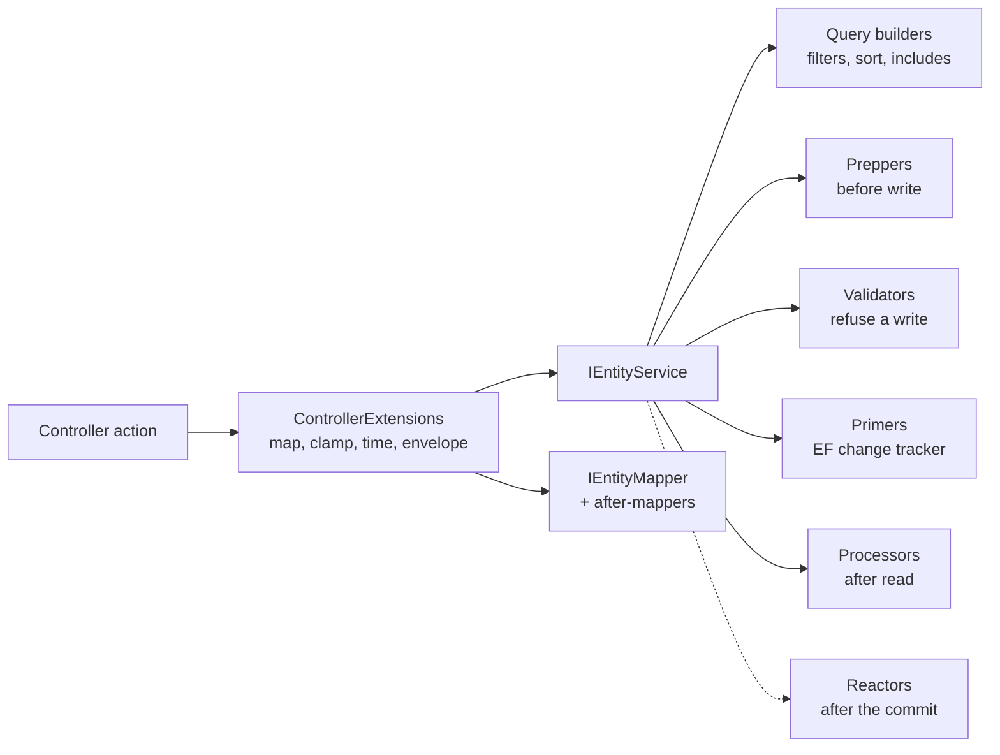

# Mediator pattern for Regira Entities Web

As of 2026-10-01. Source of every claim on this page: the `Regira-Packages` repository, branch `wip` at `5219481`.

**Status: proposal, not built. Four questions are open (see *Open questions*). The first decides whether the dispatch is a mediator at all.**

## Recommendation

Decision: the controllers stay the framework's HTTP surface, and an HTTP-neutral layer of entity operations is implemented beside them. Whether that layer dispatches through a mediator or is a plain operations service is open question 1. The steps below describe the mediator, and *An operations service without a dispatcher* says what changes for the service. The controllers are already one-line adapters, so they can take on either with little disruption, and their public contract does not change. A minimal-API surface mapped from the registrations is an optional later step. An application that chooses it writes no controllers, while the controllers stay in the package for every other application.

The proposal, in order:

1. Extract the orchestration in `ControllerExtensions` into HTTP-neutral request handlers, one per operation (details, list, search, save, patch, delete).
2. Dispatch them through a small in-house sender with pipeline behaviours. No third-party mediator library.
3. Resolve the default handler for each request by convention, with a registered closed handler as the per-entity override. `For<>()` registers nothing, and the DI package is untouched.
4. Keep `EntityControllerBase` and its seven overloads exactly as they are for consumers, and have each action build a request and call the sender. Routes, arity contract, filters, validator and tests stay unchanged; the guides gain recipes (rollout step 4). This is a minor version of `Regira.Entities.Web`.
5. Expose the sender as a first-class API next to the controllers. Hand-written domain actions, jobs, seeders and a consumer's own endpoints send the same requests the controllers send.
6. Optionally, map minimal-API endpoints from the registrations with one call, `app.MapEntityEndpoints()`. An application that chooses it writes no controller subclass at all. The controllers stay in the package for applications that keep them.

With the operations service instead (open question 1), step 1's handlers become the service's methods, step 2 and the pipeline behaviours drop out, step 3 becomes an open-generic registration with closed overrides, timing stays inline, and step 4 is unchanged.

What a mediator does **not** buy here is per-entity pre- and post-processing. That is already covered below the controller by preppers, validators, processors, primers, reactors, query builders and the wrapping service base.

## What the controllers are today

The controller bases declare routes and nothing else. Every action in `EntityControllerBase` is a one-line forward to a static helper on `ControllerBase`. All orchestration lives in `ControllerExtensions` under `src/Entities.Web/Controllers/`.

| Piece | Where it lives | What it does | MVC-bound? |
| --- | --- | --- | --- |
| `EntityControllerBase<>` (7 overloads: 1 to 4 type arguments chain to the simple 5-arity root, 6 to the complex 7-arity root) | `Controllers/Abstractions/EntityControllerBase.cs` | Route attributes, `virtual` actions, `?? NotFound()` | Yes |
| `ControllerExtensions` | `Controllers/ControllerExtensions.cs` | Resolve service and mapper, clamp paging, stopwatch, map DTO, wrap envelope. Save and Delete catch `EntityInputException<TEntity>` (400), `EntityConstraintException` and `EntityConcurrencyException` (409) | Yes, through four seams (below) |
| `EntitySaveHelper` | `EntitySaveHelper.cs` | Archived-inclusive existence check, `IsArchived` preservation, refetch-after-save policy | No, documented as reusable by any HTTP surface |
| `ApplyPagingDefaults` | `Regira.Entities`, `Models/EntityListOptionsExtensions.cs` | Default and max page size clamp | No |
| Result records (`DetailsResult`, `ListResult`, `SearchResult`, `SaveResult`, `DeleteResult`, `CountResult`) | `Models/` | Response envelopes | No |
| `EntityExceptionFilter` and `EntityConstraintConflictAttribute` | `Controllers/` | `EntityInputException` to 400 with the error map, constraint and concurrency exceptions to 409. The filter is application-wide once `MapEntityExceptions()` registers it, which `ConfigureDefaultJsonOptions()` calls. The attribute carries only the two 409s, and sits on the attachment bases | Yes |
| `ControllerRegistrationValidator` | `Validation/` | Startup check that each controller's generics have a matching `IEntityService<>` registration; also warns about missing attachment URIs | Yes, reflects over `ApplicationPartManager` |
| `ControllerDtoShapeSource` | `Validation/` | Hands each controller's `TDto` and `TInputDto` to the startup checks that judge DTOs | Yes, reflects over `ApplicationPartManager` |
| `AttachmentUriResolver<>` | `Attachments/Services/` | Builds the download link for attachment DTOs | Yes, `GetUriByAction("GetFile")` with the controller name derived from the attachment type name, as `{Name}` or `{Name}s` |
| `EntityAttachmentControllerBase<>` and `AttachmentControllerBase` | `Attachments/Abstractions/` | Upload, replace, download, list attachments. `AttachmentControllerBase` takes its services through its constructor | Yes, `IFormFile`, `[FromForm]`, `this.File()` from `Regira.Web` |

**The four seams that bind the helpers to MVC.** Everything else in the helpers is plain C# over `IEntityService` and `IEntityMapper`.

1. **Service resolution** goes through `HttpContext.RequestServices` instead of constructor injection. This is deliberate: consumer subclasses have no constructor to keep compatible.
2. **Errors** are expressed as `ModelState`, `BadRequest(ModelState)`, `Conflict(problem)`, and a bodyless `BadRequest()`, which `[ApiController]` turns into a `ProblemDetails`.
3. **PATCH** reads `Request.Body` directly and takes the serializer options from the MVC `JsonOptions`.
4. **PATCH validation** runs `TryValidateModel` on the merged input.

**The catch blocks carry a promise.** The Save and Delete helpers answer `EntityInputException<TEntity>` with 400, and `EntityConstraintException` and `EntityConcurrencyException` with 409. The attachment controller's upload (`Add`), file replace (`Modify`) and `Update` catch the 400. Its 409s come from `[EntityConstraintConflict]` on the attachment bases, which the generated entity controllers do not carry.

- In a host where `MapEntityExceptions()` registered `EntityExceptionFilter`, the filter would answer the same.
- A host that registered no filter relies on the catch blocks, and without them answers 500 for a refused write and a conflict alike.
- 6.5.0 promises the 400 from the generated save and `DELETE` and from the attachment upload and file replace "with or without `MapEntityExceptions()`". `EntityValidatorWebTests` pins that on a host without the filter.
- The filter exists so hand-written domain actions answer a rule breach the same way the generated actions do.

**What consumers build on top of the controller shape.** These are the extension points a redesign has to keep working, taken from the guides in `src/Common.Entities/ai/`.

- A subclass with N+2 generic arguments mirroring the `For<>()` registration. A wrong arity compiles and fails startup validation, which runs in Development by default. A Roslyn analyzer for this alignment is an open framework ask in `ai/learnings.md`.
- DTOs declared on the controller alone, which is the documented default. `ControllerDtoShapeSource` hands them to startup validation.
- Overriding a `virtual` action, for example `[AllowAnonymous]` on `GetFile` for public downloads.
- A second controller on the same route for domain actions, answering with `this.Details<TEntity, TDto>(id)` from `Regira.Entities.Web.Controllers`.
- A global `IAsyncActionFilter` that keys write authorization on the `controller` route value and the action's route template.
- `RoutePrefixConvention`, an `IApplicationModelConvention`, to put every controller under a configurable base path.
- `MapControllers().RequireAuthorization()` as the documented way to secure the generated endpoints.
- Complex `[FromQuery] TSearchObject` binding, `AddNewtonsoftJson` in the test API, and `IFormFile` with `[FromForm] TInputDto` on uploads.

## A dispatcher already exists below the controller

`IEntityService` with its extension points is already a per-entity command and query pipeline. A mediator would be a second dispatcher for the same six operations, so its value has to come from the layer above the service, not from replacing it.


```mermaid
flowchart LR
    HTTP[Controller action] --> CE[ControllerExtensions<br/>map, clamp, time, envelope]
    CE --> SVC[IEntityService]
    SVC --> QB[Query builders<br/>filters, sort, includes]
    SVC --> PR[Preppers<br/>before write]
    SVC --> VA[Validators<br/>refuse a write]
    SVC --> PM[Primers<br/>EF change tracker]
    SVC --> PC[Processors<br/>after read]
    SVC -.-> RE[Reactors<br/>after the commit]
    CE --> MAP[IEntityMapper<br/>+ after-mappers]
```

The controller extension box is the only layer with no abstraction of its own. It is where a mediator's request and handler belong.

| Concern | Handled today by | Would a mediator add anything? |
| --- | --- | --- |
| Per-entity logic before a write | Preppers, primers, `[ServerOwned]` | No |
| Refusing a write | Validators, in every write path and on a delete | No |
| Per-entity logic after a read | Processors, after-mappers | No |
| Work after the commit (mail, jobs, audit of writes) | Reactors, transaction-aware | No |
| Row security and filtering | Global and filtered query builders | No |
| Replacing a service method for one entity | `EntityWrappingServiceBase` decorator | No |
| Orchestration without a fake `HttpContext` in unit tests | Nothing; the helpers need `ControllerBase` | Yes |
| Replacing one operation for one entity without subclassing a controller | Overriding a `virtual` action | Yes, a closed handler registration |
| Cross-cutting behaviour at the operation level: timing, list caching, auditing the operation itself (caller, refused attempts, reads) | Stopwatch inline; otherwise MVC filters | Yes, pipeline behaviours |
| One implementation feeding the controllers and every other caller (domain actions, jobs, seeders) | Nothing. A job calls `IEntityService` directly, which runs the validators and reactors but not the refetch-after-save, the archived-state preservation or the DTO mapping | Yes |

The last four rows are the case for the pattern. The first six are why it should stay above `IEntityService` and never wrap it. Only the cross-cutting row needs a dispatcher; see open question 1.

## Recommended design

Four steps, each shippable on its own. None of them changes a route, an envelope or a consumer signature. The fifth and sixth points of the recommendation, exposing the sender to consumers and the optional minimal-API surface, are the two sections after step 4.

### Step 1: HTTP-neutral requests and handlers

A new namespace, `Regira.Entities.Web.Operations`, with no ASP.NET Core types, so it can move to a lower package later. There is one record per operation and shape, carrying the same type arguments the helpers take today.

```csharp
public interface IEntityRequest<TResponse>;

public sealed record DetailsQuery<TEntity, TKey, TDto>(TKey Id, ArchivedFilter? Archived = null)
    : IEntityRequest<DetailsResult<TDto>>;
// simple: one search object, as the simple controllers bind it
public sealed record ListQuery<TEntity, TKey, TSo, TDto>(TSo? SearchObject, PagingInfo? Paging)
    : IEntityRequest<ListResult<TDto>>;
// complex
public sealed record ListQuery<TEntity, TKey, TSo, TSortBy, TIncludes, TDto>(
    IList<TSo?> SearchObjects, PagingInfo? Paging, TIncludes[] Includes, TSortBy[] SortBy)
    : IEntityRequest<ListResult<TDto>>;
public sealed record SearchQuery<TEntity, TKey, TSo, TDto>(TSo? SearchObject, PagingInfo? Paging)
    : IEntityRequest<SearchResult<TDto>>;
public sealed record SearchQuery<TEntity, TKey, TSo, TSortBy, TIncludes, TDto>(
    IList<TSo?> SearchObjects, PagingInfo? Paging, TIncludes[] Includes, TSortBy[] SortBy)
    : IEntityRequest<SearchResult<TDto>>;
public sealed record SaveCommand<TEntity, TKey, TDto, TInputDto>(TInputDto Input, TKey? Id = default)
    : IEntityRequest<SaveResult<TDto>>;
public sealed record PatchCommand<TEntity, TKey, TDto, TInputDto>(TKey Id, JsonElement Patch, JsonSerializerOptions SerializerOptions)
    : IEntityRequest<SaveResult<TDto>>;
public sealed record DeleteCommand<TEntity, TKey, TDto>(TKey Id)
    : IEntityRequest<DeleteResult<TDto>>;

public interface IEntityRequestHandler<in TRequest, TResponse>
    where TRequest : IEntityRequest<TResponse>
{
    // null = not found. EntityInputException, EntityConstraintException and
    // EntityConcurrencyException propagate to the caller.
    Task<TResponse?> Handle(TRequest request, CancellationToken token = default);
}

public delegate Task<TResponse?> EntityRequestDelegate<TResponse>();

public interface IEntityPipelineBehavior<in TRequest, TResponse>
    where TRequest : IEntityRequest<TResponse>
{
    Task<TResponse?> Handle(TRequest request, EntityRequestDelegate<TResponse> next, CancellationToken token = default);
}

public interface IEntitySender
{
    Task<TResponse?> Send<TResponse>(IEntityRequest<TResponse> request, CancellationToken token = default);
}
```

Design decisions inside the handlers:

- **Not found is `null`, errors are exceptions.** This matches how `IEntityService` behaves today, so a consumer calling the sender from a job or a seeder gets the same contract. A consumer's own endpoint maps the three exceptions with an `IExceptionHandler`. The controller adapters keep the catch blocks they have today, because a host without `EntityExceptionFilter` relies on them: the 400 and both 409s in Save and Delete, and the 400 in the attachment upload, file replace and `Update`.
- **Simple and complex are separate request shapes,** because the controllers are two hierarchies.
  - A simple request carries one search object and resolves `IEntityService<TEntity, TKey>`, as the simple helpers do. `For<TEntity, TKey, TSearchObject>()` registers that form and `IEntityService<TEntity, TKey, TSearchObject>`, but never the five-argument form with the default sort and include types.
  - A complex request resolves the five-argument form.
  - Telling them apart by the default types would send a complex registration that uses those types down the simple path.
- **PATCH takes a `JsonElement` and `JsonSerializerOptions`.** Reading the body and picking the options stays in the controller action. The merge logic in `ApplyJsonMergePatch` moves over unchanged.
- **DataAnnotations validation of the input runs in the save and patch handlers, not in a pipeline behaviour.**
  - Why not a behaviour: a behaviour sees the `PatchCommand`, which is an id and a JSON patch. The merged input exists only inside the handler.
  - It validates nested objects as `TryValidateModel` does; `Validator.TryValidateObject` alone does not descend into them.
  - It throws `EntityInputException<TEntity>`, so the 400 has the same body as a validator's refusal.
  - MVC's automatic 400 for the plain `PUT` body keeps running in front of it.
  - This checks the input DTO before mapping. Refusing a write on the entity's state stays the job of the validators, which run inside the write service for every caller.
- **Timing is a pipeline behaviour** that fills `Duration` on every result, replacing the stopwatch repeated in each helper.
- `EntitySaveHelper` is called from the handlers as it is called from the helpers now.

### Step 2: an in-house sender

The sender:

- closes `IEntityRequestHandler<,>` over the request's runtime type and the response type;
- caches the closed type per request type;
- resolves it from the request scope;
- wraps it in every registered `IEntityPipelineBehavior<,>` for that pair.

It is roughly a hundred lines. Its only dependency is `Microsoft.Extensions.DependencyInjection.Abstractions`, which `Regira.Entities.Web` has through ASP.NET Core. `Regira.Entities` references no DI package (open question 2). The reasons to build rather than take a library are in their own section below.

### Step 3: default handlers by convention, overrides by registration

The sender asks the request scope for `IEntityRequestHandler<TRequest, TResponse>`. When nothing is registered, it builds the default by convention from the request type, `DetailsQuery<TEntity, TKey, TDto>` to `DetailsHandler<TEntity, TKey, TDto>`, through `ActivatorUtilities`, and caches the closed type per request type.

The built-in container cannot express that mapping as an open-generic registration, since the handler's type parameters do not line up one to one with the interface's. That is why the default is built rather than registered. `For<>()` registers nothing, and the DI package is untouched.

A consumer overrides one operation for one entity by registering a closed handler. This replaces the `virtual` action override, and needs no controller subclass:

```csharp
services.AddTransient<
    IEntityRequestHandler<DetailsQuery<Product, int, ProductDto>, DetailsResult<ProductDto>>,
    CachedProductDetailsHandler>();
```

The free-tier registration count stays on `For<>()` and is unaffected. The DTO pair travels on the request, so an entity registered without `UseMapping()` still works through the controllers exactly as `EntityControllerBase<TEntity>` does now.

### Step 4: controllers become adapters

Each action builds a request and sends it. The sender resolves from `HttpContext.RequestServices`, so no consumer constructor changes. That is the compatibility shape the repo already uses for late additions to shipped bases.

```csharp
[HttpGet("{id}")]
public virtual async Task<ActionResult<DetailsResult<TDto>>> Details([FromRoute] TKey id, [FromQuery] ArchivedFilter? archived = null)
    => await Sender.Send(new DetailsQuery<TEntity, TKey, TDto>(id, archived)) ?? NotFound();
```

The `ControllerExtensions` helpers keep their public signatures and their catch, and delegate to the sender, so the domain-action recipe that calls `this.Details<TEntity, TDto>(id)` keeps compiling.

These stay as they are:

- the seven overloads and the route table;
- the startup validators and both filters;
- the docs and the integration tests;
- the attachment controllers, which can stay on the helpers or gain their own upload and download requests in a later change.

## Using the mediator beside the controllers

The controllers are one caller of the sender. The same requests are available to every other place that needs an entity operation with the full HTTP-boundary semantics: paging clamp, refetch-after-save, archived-state preservation, DTO mapping and the result envelope.

```csharp
// a hand-written domain action beside the entity controller
item.Status = RequestStatus.Approved;
await service.Modify(item);
await service.SaveChanges();
return await Sender.Send(new DetailsQuery<CreditRequest, int, CreditRequestDto>(id)) ?? NotFound();

// a background job or seeder, outside any request
var saved = await sender.Send(new SaveCommand<Product, int, ProductDto, ProductInputDto>(input));

// a consumer's own minimal-API endpoint
app.MapPost("/products/import", async (IEntitySender sender, ProductInputDto input)
    => await sender.Send(new SaveCommand<Product, int, ProductDto, ProductInputDto>(input)));
```

Today the first case goes through `this.Details<TEntity, TDto>(id)`, which keeps working. The other two have no framework path: they re-implement the orchestration or call `IEntityService` directly. That runs the validators and reactors, but loses the refetch, the archived-state rule and the DTO mapping.

A caller outside a controller spells the full type list, as in `ListQuery<Product, int, ProductSearchObject, ProductSortBy, ProductIncludes, ProductDto>`. A type list that matches no registration fails at its first call. A controller's is reported by startup validation, which runs, and stops the host on such an error, in Development by default.

Ship it beside the controllers, not instead of them. The controllers remain the framework's HTTP surface unless an application opts into the mapped endpoints below, and nothing about their routes, binding or attributes moves.

**What stays the controllers' job.** These are MVC features, and the sender does not take them over:

- Binding the query string to `TSearchObject`, `PagingInfo`, `?includes=` and `?sortBy=`.
- Automatic 400 for a DataAnnotations failure on the request body.
- Answering a refused write with 400, and a constraint or concurrency conflict with 409, in a host without `EntityExceptionFilter`.
- Reading the PATCH body and choosing the serializer options.
- Attachment URIs through `AttachmentUriResolver`, which links by controller name.
- Form uploads with `IFormFile` and `[FromForm] TInputDto`.
- The route prefix convention, `MapControllers().RequireAuthorization()` and the write-authorization filter recipe.

**Optional.** The framework can also map every entity's endpoints itself from the registrations, which is the next section. A consumer who writes their own endpoints on top of the sender owns the binding and validation listed above.

## Optional: minimal-API endpoints mapped from the registrations

If an application chooses this, it replaces the controllers there: nobody writes a controller subclass, and the `/new-entity` scaffold produces no web file. One call maps every registered entity, because the registrations carry everything but the route and, in the documented default, the DTO pair.

```csharp
app.MapEntityEndpoints();                              // every entity registered through For<>()
app.MapEntityEndpoints().RequireAuthorization();       // one policy for all of them
app.MapEntityEndpoints(o => o.Prefix = "api");         // shared base path, the RoutePrefixConvention equivalent
```

What the framework knows per entity at startup, and where it comes from:

| Fact | Source today |
| --- | --- |
| `TEntity`, `TKey`, `TSearchObject`, simple or complex | `EntityRegistrationLog`, which every `For<>()` overload already writes to |
| `TSortBy`, `TIncludes` | Known in the complex `For<>()` overloads but not yet logged: two more `Type` fields on the same record |
| `TDto`, `TInputDto` | `UseMapping<TDto, TInputDto>()`, which registers an `EntityMappingRegistration` singleton with the three types. Declaring the DTOs on the controller alone is the documented default, so most entities have no such registration. A mapped entity declares its pair on the registration (open question 3) |
| Attachment sub-routes | `HasAttachments()` and `WithAttachments()` |
| Route | Nothing; today it is the controller's `[Route]`. Convention: the kebab-case plural of the entity name (`Product` to `products`, `PersonAttachment` to `person-attachments`), which is the spelling the SPA calls, with a per-entity override through the web-side `Endpoints()` extension. The repo has no pluralizer, and an irregular noun (`Person`) needs the override |

**How the pieces join.** Nothing web-related enters the DI package. It already records each registration's types in `EntityRegistrationLog` and the DTO pair in `EntityMappingRegistration`, both plain `Type` data.

- **Options.** Route and endpoint options are an extension method that `Entities.Web` defines on the per-entity builders. `UseAttachmentUris()`, `ConfigureDefaultJsonOptions()` and `ValidateEntityControllers()` already extend the DI options and `IServiceCollection` from the web side. `Endpoints()` is the first web-side extension on the builders themselves, and it keeps each of the five builder types for chaining, as `Validate` and `React` do. It stores an `EntityEndpointOptions` per entity in the service collection the builder exposes.
- **Mapping.** `MapEntityEndpoints()` in `Entities.Web` joins the three at startup and closes a generic `MapEntity<TEntity, TKey, TSearchObject, TSortBy, TIncludes, TDto, TInputDto>` per entity with `MakeGenericMethod`. Every endpoint is a lambda that builds the request and calls the sender, so there is no reflection per request.
- **Policies.** The call returns the `RouteGroupBuilder`, and a callback hands out the per-entity group for policies that differ by entity.

Per-entity control lives on the registration, next to the pipeline configuration it belongs with:

```csharp
// Endpoints(...) is an extension method from Regira.Entities.Web; the builder itself knows nothing of routes
services.For<Product, ProductSearchObject, ProductSortBy, ProductIncludes>(e =>
{
    e.UseMapping<ProductDto, ProductInputDto>();
    e.Endpoints(o =>
    {
        o.Route = "catalog-items";                 // convention override
        o.Exclude(EntityEndpoint.Delete);           // trim the set
        o.AllowAnonymous(EntityEndpoint.Download);  // the public-attachment recipe, no controller override needed
    });
});
services.For<AuditLog>(e => e.Endpoints(o => o.Disable()));   // keep this one off the surface
```

Custom actions are ordinary endpoints beside the mapped ones, calling the sender, such as `app.MapPost("credit-requests/{id}/approve", ...)`. Replacing one operation for one entity is the closed handler registration from step 3.

**Coexistence.** An entity served by both a controller and a mapped endpoint on the same route is an ambiguous match at runtime.

- `MapEntityEndpoints()` therefore skips every entity whose `EntityControllerBase<>` subclass MVC has discovered, and logs the skip.
- An application can migrate one entity at a time.
- The explicit `MapEntity<...>("products")` overload stays for a hand-picked entity.

The work items are real, and each maps to an MVC feature the controllers rely on:

| Work item | Why | Approach |
| --- | --- | --- |
| Query binding of `TSearchObject` | Minimal APIs bind only simple types from the query string. `[FromQuery] TSearchObject` with arrays and enums is MVC's complex binder | `[AsParameters]` for flat objects, or a `BindAsync` on the search-object base. Verify against `ArchivedQueryBindingTests` |
| DataAnnotations validation | Minimal APIs have no `ModelState`. .NET 10 adds built-in validation, net8.0 does not | The handler validation from step 1 covers both target frameworks |
| Form uploads | Minimal-API form binding enforces antiforgery by default, which SPA clients do not send | `DisableAntiforgery()` on the attachment endpoints, documented as a deliberate choice |
| Attachment URIs | `AttachmentUriResolver` links by controller name derived from the attachment type | Name the download endpoint and resolve with `GetUriByName`, keeping the controller lookup as a fallback |
| JSON serializer | Minimal APIs serialize with System.Text.Json only | A host on `AddNewtonsoftJson` keeps the controllers. Say so in the guide |
| Route naming | The SPA calls the resource path, `/products`, which the controller's `[Route]` supplies today | Kebab-case plural convention from the entity name, with the per-entity override on the registration |
| OpenAPI metadata | `[ApiController]` and `ActionResult<T>` produce the schemas today | `.Produces<T>()` and `.ProducesProblem()` per endpoint, generic so it is written once |
| Write authorization recipe | The documented filter keys on the `controller` route value and the action descriptor | An endpoint filter keyed on HTTP method and endpoint name, as a second recipe |
| Startup validation | `ControllerRegistrationValidator` reflects over MVC application parts, and `ControllerDtoShapeSource` hands the controllers' DTOs to the DTO checks | `ControllerRegistrationValidator` is not needed for mapped endpoints, since their descriptors come from `For<>()` itself, but the missing-`UseAttachmentUris()` warning it hosts moves to a check of its own, since mapped attachment endpoints need the resolver too. Mapped endpoints contribute their DTO pair to the DTO checks the way `ControllerDtoShapeSource` does. A new check reports an entity served by both surfaces |
| Guides and tooling | Route table in three guides, `/new-entity` scaffolds a controller, the MCP knowledge base, the `@regira/modules` front-end guide | A second registration form in each, beside the controller one; `/new-entity` skips the controller when the app maps endpoints |

## An operations service without a dispatcher

Three of the four rows that make the case need HTTP-neutral code, not a dispatcher: tests without `HttpContext`, one implementation for every caller, and replacing one operation for one entity. An operations service delivers those three with less machinery.

- **Registration.** An `IEntityOperations<…>` interface whose type parameters match its implementation's one to one registers as an open generic in the built-in container. That means no convention-built handlers and no reflection in a sender.
- **Callers.** A job injects it, and the controller adapters resolve it from `RequestServices`.
- **Overrides.** An override for one entity is a closed registration of a subclass that overrides one virtual method, the counterpart of step 3's closed handler.
- **What it lacks** is the uniform pipeline, so cross-cutting behaviour becomes a decorator per operation. Of the behaviours named here:
  - timing is one stopwatch;
  - auditing a write belongs to the reactors, which see the commit a behaviour cannot;
  - list caching has no request behind it yet.

What changes against the mediator plan:

- Step 1's handlers become the service's methods, and the request records become their parameters.
- Step 2 and the pipeline behaviours drop out, and timing stays inline.
- Step 3's convention-built defaults give way to the open-generic registration, with a closed registration as the override.
- Step 4 is unchanged, except that the controllers call the service instead of the sender.

## Why an in-house sender and not a library

The repo precedent is that the hub owns the abstraction and provider packages adapt third parties: `IEntityMapper` in `Regira.Entities`, with `Entities.Mapping.AutoMapper` and `Entities.Mapping.Mapster` behind it. The same shape fits here, and the abstraction is small enough that no default provider is needed.

| Option | Licence | Fit for a framework package | Verdict |
| --- | --- | --- | --- |
| MediatR 13 and later | Commercial, with a free tier by organisation size | A commercially licensed hub pulling a second commercial dependency transitively is a problem every consumer inherits | No |
| MediatR 12 pinned | Apache-2.0 | Unmaintained line; consumers who upgrade get a binding conflict | No |
| Source-generated mediators (Mediator, others) | MIT | The generator runs in the consuming assembly and cannot generate dispatch for generic handlers living in a referenced package | No |
| Wolverine | Open source with commercial support | Message-bus scope far beyond six operations, opinionated hosting | No |
| In-house `IEntitySender` | Apache-2.0 with the hub | About a hundred lines, one dependency already present in `Entities.Web`, default handlers by convention | Yes |

A bridge package for consumers who already run MediatR, such as `Regira.Entities.Mediator.MediatR`, can be added later if asked for. It would adapt `IEntitySender` onto their `ISender`, the way the mapping providers adapt `IEntityMapper`.

The main thing the in-house sender must get right is what the libraries also do: cache the closed handler and behaviour types per request type, and resolve per request scope so handlers can take the scoped `IEntityService` and `DbContext`.

## Blast radius, versioning and rollout

The change touches no route, envelope or consumer signature, so the existing integration tests are the acceptance suite. The table lists what is pinned to the controller shape and therefore must not move. The optional minimal-API surface needs a mirrored test set of its own; it changes nothing for applications that keep the controllers.

| Surface pinned to the current controller shape | Count |
| --- | --- |
| Tests in `tests/Entities.Web.Testing` that run through a real host. The suite holds 157 tests in 18 files; the rest are unit tests | ~88 |
| Doc files referencing `EntityControllerBase`: 10 AI guides, which feed the MCP knowledge base, and 6 developer docs | 16 |
| Front-end guide for `@regira/modules` mirroring the route table | 1 |
| Code samples in `entities.patterns.md` calling the controller helpers directly | 2 |

**Versioning.** One minor of `Regira.Entities.Web`: new public types, no consumer adoption required. The optional minimal-API surface is a further minor of `Regira.Entities.Web`, and a patch of `Regira.Entities.DependencyInjection` for the two `Type` fields added to `EntityRegistrationLog`. No major: the controllers are neither removed nor changed in contract. Both packages are at an unpublished 6.5.0; the final numbers are the maintainer's call.

**Rollout order.**

1. Steps 1 and 2, with unit tests on the handlers and the sender, and no controller change yet. `EntitySaveHelperTests` is the template for testing the helpers without a host.
2. Step 3, with tests that the convention resolves a default handler for every request shape and that a registered closed handler wins over it.
3. Step 4: run the full `Entities.Web.Testing` suite, including `EntityValidatorWebTests` on a host without the exception filter. With the mediator, the `Duration` field moving to a behaviour is the one observable change to check.
4. Guide update through `/update-guide`:
   - the web namespaces guide gains the `Operations` namespace;
   - the patterns guide gains the handler-override recipe and the sender-from-a-job recipe;
   - `CHANGELOG.md` gets the bullets.
5. The optional minimal-API surface as its own change, starting from its work-item table. Spike the query-binding item first, because it decides whether `SearchObject` needs a `BindAsync`.

## Open questions

1. **A mediator or an operations service?** The sender earns its place only through pipeline behaviours; the other three reasons are served by an operations service (see *An operations service without a dispatcher*). Recommendation: the operations service, until a pipeline behaviour has a consumer asking for it.
2. **Do the result records and `EntitySaveHelper` move one package down later,** so a non-web host can use the handlers without referencing `Regira.Entities.Web`? `Regira.Entities` references no DI package today, so the move would bring `Microsoft.Extensions.DependencyInjection.Abstractions` with it.
3. **How does a mapped entity declare its DTO pair?** Through `UseMapping<TDto, TInputDto>()` or on `Endpoints()`. Falling back to `TEntity` for an entity that declares neither would silently change the wire shape of every app that follows the documented default and declares its DTOs on the controller. Recommendation: no fallback. Startup refuses an entity mapped without a pair, and an entity served as itself says so.
4. **With the mediator, is the `Duration` field worth keeping** once timing is a behaviour, or does it become opt-in?
