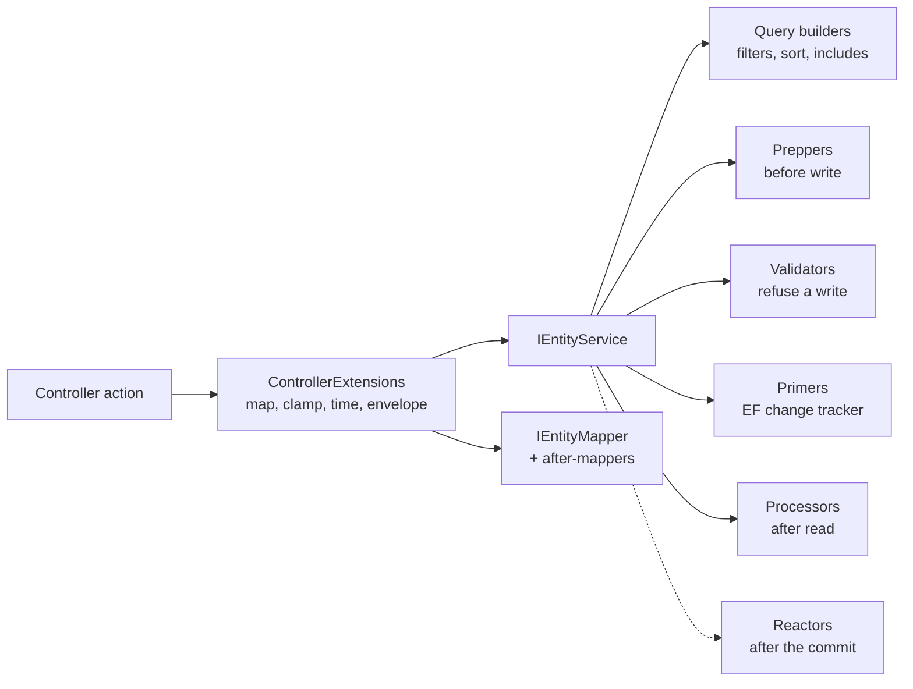
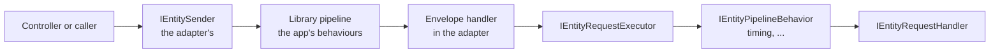

# Mediator pattern for Regira Entities Web

As of 2026-10-09. Sources: the `Regira-Packages` repository, branch `wip` at `b32dbe1`; the README of the source-generated Mediator library ([martinothamar/Mediator](https://github.com/martinothamar/Mediator)) and Microsoft Learn's [Parameter binding in Minimal API applications](https://learn.microsoft.com/aspnet/core/fundamentals/minimal-apis/parameter-binding), both read on 2026-10-09. The other libraries' licences are as their projects state them. The design below predates the build; *Outcome* records what was built and where it differs.

**Status: built on `wip` on 2026-10-10 through rollout step 5, uncommitted (see *Outcome*). The optional minimal-API surface, rollout step 6, is not built, and open question 3 waits for it.**

## Outcome

Built as recommended — the mediator (open question 1), with the in-house sender as the default and MediatR as the first adapter — in two new packages, both under the Regira Commercial License at the family's 6.5.1:

- **`Regira.Entities.Mediator`** holds the requests, the default handlers, `IEntityRequestExecutor`, the in-house `EntitySender` and the input check. Open question 2 is answered for now with this package of its own rather than a move into `Regira.Entities` or the DI package. It references `Regira.Entities.DependencyInjection` alone, as the FluentValidation adapter does, so a worker host takes no ASP.NET Core with it. The response envelopes and `EntitySaveHelper` moved here under their old namespaces, and `Regira.Entities.Web` forwards them (`TypeForwards.cs`).
- **`Regira.Entities.Mediator.MediatR`** is the adapter: `UseMediatR()`, the closed envelope `EntityRequestMessage : IRequest<object?>` and its handler, and `MediatREntitySender`. Open question 5: it references MediatR 12.0.0 as its floor, and its tests pass on 12.0.0, 13.1.0 and 14.2.0.

Where the build differs from the design:

- **Timing is the executor's, not a behaviour.** `Duration` is filled wherever the executor runs — under any sender, and in a host wired without `UseEntities()` — and needs no registration. Open question 4 is decided as recommended: it stays filled by default.
- **The controllers are unchanged.** They already forward to the `ControllerExtensions` helpers, and the helpers now send the requests, so step 4 changed the helpers alone.
- **Registration** is `AddEntityMediator()`, which `UseEntities()` invokes late-bound. `GetEntitySender()` falls back to an in-house sender where nothing is registered, so a host wired by hand keeps working.
- **The input check is a seam, `IEntityInputValidator`.** Plain DataAnnotations would have made a patch's check weaker than MVC's `TryValidateModel`: MVC refuses `null` for a non-nullable reference without `[Required]`, and runs the app's validator providers. `Regira.Entities.Web` therefore contributes `MvcEntityInputValidator`, bound late by `AddEntityMediator()`; other hosts get the recursive `DataAnnotationsEntityInputValidator`.
- **`SaveCommand` has `ValidateInput`, default `true`.** The controllers pass `false`, so an app that suppressed MVC's automatic 400 still saves what model binding let through, as before. A patch's merged input is always checked.
- **A patch saves through the shared save routine**, not through the `SaveCommand` handler, as the PATCH helper called the Save helper rather than the Save action before. The patterns guide says to override both when a save must change.
- **`PatchCommand.SerializerOptions` is optional.** The default is the Web defaults ignoring cycles, the options the PATCH helper fell back to. A non-object patch is refused in the controller as before, and a job's gets an `ArgumentException`.
- **Every request carries `EntityType` and `Operation`** through the non-generic `IEntityRequest`, implemented explicitly so the records' own members stay their data.

Verified: `tests/Entities.Mediator.Testing` (new, 24 tests) on the three MediatR versions. `Entities.Web.Testing` (190) passes; its PATCH test now expects `errorDetails`, the planned body change. `Entities.Testing`, `Entities.DependencyInjection.Testing`, `Entities.Mapping.Mapster.Testing` and `Entities.Providers.Testing` pass, and the GuideVerifier `entities` group compiles. The guides gained *Entity operations outside a controller* in `entities.patterns`, with the signatures, namespaces, card, setup and instructions entries, and `docs/web-endpoints` *Entity Operations*. The licensing lists, the routing tables, the solution and `CHANGELOG.md` are updated.

## Recommendation

Decision: the controllers stay the framework's HTTP surface, and an HTTP-neutral layer of entity operations is implemented beside them. Whether that layer dispatches through a mediator or is a plain operations service is open question 1. The steps below describe the mediator, and *An operations service without a dispatcher* says what changes for the service. The controllers are already one-line adapters, so they can take on either with little disruption, and their public contract does not change. A minimal-API surface mapped from the registrations is an optional later step. An application that chooses it writes no controllers, while the controllers stay in the package for every other application.

The proposal, in order:

1. Extract the orchestration in `ControllerExtensions` into HTTP-neutral request handlers, one per operation (details, list, search, save, patch, delete).
2. Dispatch them through a small in-house sender with pipeline behaviours, behind `IEntitySender`. The hub takes no third-party mediator library. `UseEntities()` registers the sender through the late binding it already uses for the controller validator.
3. Resolve the default handler for each request by convention, with a registered closed handler as the per-entity override. `For<>()` registers nothing.
4. Keep `EntityControllerBase` and its seven overloads exactly as they are for consumers, and have each action build a request and call the sender. Routes, arity contract, filters, validator and tests stay unchanged; the guides gain recipes (rollout step 4). This is a minor version of `Regira.Entities.Web`.
5. Expose the sender as a first-class API next to the controllers. Hand-written domain actions, jobs, seeders and a consumer's own endpoints send the same requests the controllers send.
6. Let a third-party mediator replace the in-house sender through an adapter package, in the shape of `Regira.Entities.Validation.FluentValidation`. The hub owns the seam and ships the default, an adapter plugs one library in with one call inside `UseEntities()`, and the app's own pipeline in that library then wraps every entity operation. MediatR is the first adapter.
7. Optionally, map minimal-API endpoints from the registrations with one call, `app.MapEntityEndpoints()`. An application that chooses it writes no controller subclass at all. The controllers stay in the package for applications that keep them.

With the operations service instead (open question 1), step 1's handlers become the service's methods, step 2 and the pipeline behaviours drop out, step 3 becomes an open-generic registration with closed overrides, timing stays inline, and step 4 is unchanged. There is nothing to send, so point 6 has no seam to plug into.

What a mediator does **not** buy here is per-entity pre- and post-processing. That is already covered below the controller by preppers, validators, processors, primers, reactors, query builders and the wrapping service base.

## What the controllers are today

The controller bases declare routes and nothing else. Every action in `EntityControllerBase` is a one-line forward to a static helper on `ControllerBase`. All orchestration lives in `ControllerExtensions` under `src/Entities.Web/Controllers/`.

| Piece | Where it lives | What it does | MVC-bound? |
| --- | --- | --- | --- |
| `EntityControllerBase<>` (7 overloads: 1 to 4 type arguments chain to the simple 5-arity root, 6 to the complex 7-arity root) | `Controllers/Abstractions/EntityControllerBase.cs` | Route attributes, `virtual` actions, `?? NotFound()` | Yes |
| `ControllerExtensions` | `Controllers/ControllerExtensions.cs` | Resolve service and mapper, clamp paging, stopwatch, map DTO, wrap envelope. Save and Delete catch `EntityInputException<TEntity>` (400), `EntityConstraintException` and `EntityConcurrencyException` (409) | Yes, through four seams (below) |
| `EntitySaveHelper` | `EntitySaveHelper.cs` | Archived-inclusive existence check, `IsArchived` preservation, refetch-after-save policy | No, documented as reusable by any HTTP surface |
| `ApplyPagingDefaults` | `Regira.Entities`, `Models/EntityListOptionsExtensions.cs` | Default and max page size clamp | No |
| Result records (`DetailsResult`, `ListResult`, `SearchResult`, `SaveResult`, `DeleteResult`, `CountResult`) | `Models/` | Response envelopes | No |
| `EntityInputExceptionExtensions.ToBadRequest` (internal) | `Controllers/EntityInputExceptionExtensions.cs` | The one builder of a refused write's 400: a `ValidationProblemDetails` from the app's `ProblemDetailsFactory`, with `errors` by key and an `errorDetails` member listing each error with its scalar args. Every catch site and the filter call it | Yes, returns a `BadRequestObjectResult` and takes the factory from MVC |
| `EntityExceptionFilter` and `EntityConstraintConflictAttribute` | `Controllers/` | `EntityInputException` to that 400, constraint and concurrency exceptions to 409. The filter is application-wide once `MapEntityExceptions()` registers it, which `ConfigureDefaultJsonOptions()` calls. The attribute carries only the two 409s, and sits on the attachment bases | Yes |
| `ControllerRegistrationValidator` | `Validation/` | Startup check that each controller's generics have a matching `IEntityService<>` registration; also warns about missing attachment URIs | Yes, reflects over `ApplicationPartManager` |
| `ControllerDtoShapeSource` | `Validation/` | Hands each controller's `TDto` and `TInputDto` to the startup checks that judge DTOs | Yes, reflects over `ApplicationPartManager` |
| `AttachmentUriResolver<>` | `Attachments/Services/` | Builds the download link for attachment DTOs | Yes, `GetUriByAction("GetFile")` with the controller name derived from the attachment type name, as `{Name}` or `{Name}s` |
| `EntityAttachmentControllerBase<>` and `AttachmentControllerBase` | `Attachments/Abstractions/` | Upload, replace, download, list attachments. `AttachmentControllerBase` takes its services through its constructor | Yes, `IFormFile`, `[FromForm]`, `this.File()` from `Regira.Web` |

**The four seams that bind the helpers to MVC.** Everything else in the helpers is plain C# over `IEntityService` and `IEntityMapper`.

1. **Service resolution** goes through `HttpContext.RequestServices` instead of constructor injection. This is deliberate: consumer subclasses have no constructor to keep compatible.
2. **Errors** are MVC results:
   - `ToBadRequest(HttpContext)` for a refused write;
   - `ValidationProblem(ModelState)` for PATCH's merged input and for an attachment link of another owner;
   - `Conflict(problem)` for the two 409s;
   - a bodyless `BadRequest()` for a PATCH body that is not JSON or not a JSON object, which `[ApiController]` turns into a `ProblemDetails`.
3. **PATCH** reads `Request.Body` directly and takes the serializer options from the MVC `JsonOptions`.
4. **PATCH validation** runs `TryValidateModel` on the merged input. Its 400 is model binding's `ValidationProblemDetails`, without `errorDetails`.

**The catch blocks carry a promise.** The Save and Delete helpers answer `EntityInputException<TEntity>` with 400, and `EntityConstraintException` and `EntityConcurrencyException` with 409. The attachment controller's upload (`Add`), file replace (`Modify`) and `Update` catch the 400. Its 409s come from `[EntityConstraintConflict]` on the attachment bases, which the generated entity controllers do not carry.

- In a host where `MapEntityExceptions()` registered `EntityExceptionFilter`, the filter would answer the same.
- A host that registered no filter relies on the catch blocks, and without them answers 500 for a refused write and a conflict alike.
- The published 6.5.0 promises the 400 from the generated save and `DELETE` and from the attachment upload and file replace "with or without `MapEntityExceptions()`", as a `ValidationProblemDetails` with `errorDetails`. `EntityValidatorWebTests` pins that on a host without the filter.
- The filter exists so hand-written domain actions answer a rule breach the same way the generated actions do.

**What consumers build on top of the controller shape.** These are the extension points a redesign has to keep working, taken from the guides in `src/Common.Entities/ai/`.

- A subclass with N+2 generic arguments mirroring the `For<>()` registration. A wrong arity compiles and fails startup validation, which runs in Development by default. A Roslyn analyzer for this alignment is an open framework ask in `ai/learnings.md`.
- DTOs declared on the controller alone, which is the documented default. `ControllerDtoShapeSource` hands them to startup validation.
- Overriding a `virtual` action, for example `[AllowAnonymous]` on `GetFile` for public downloads.
- A second controller on the same route for domain actions, answering with `this.Details<TEntity, TDto>(id)` from `Regira.Entities.Web.Controllers`.
- A global `IAsyncAuthorizationFilter`, the role-gated write authorization filter in `entities.patterns.md`. It keys write roles on the controller type and refuses a write to a controller it has no entry for. It tells a read from a write by HTTP method and route template, and exempts only an action that carries `[AllowAnonymous]` itself. It runs before model binding, so an unauthorized write gets its 401 or 403 whatever its body holds.
- `RoutePrefixConvention`, an `IApplicationModelConvention` that `Regira.Web.Routing`'s `UseCentralRoutePrefix` adds, to put every controller under a configurable base path.
- The attachment controller routed on its owner's path, `[Route("products")]` on `ProductAttachmentController`, under which the base appends `{objectId}/files`, `{objectId}/attachments` and the rest.
- The attachment base's route contract. The route's `id` and `objectId` win over the body, an upload always creates a new link, and a link of another owner is a 400 keyed `objectId`. `CourseAttachmentsControllerTests` pins it.
- `MapControllers().RequireAuthorization()` as the documented way to secure the generated endpoints.
- Complex `[FromQuery] TSearchObject` binding, `AddNewtonsoftJson` in the test API, and `IFormFile` with `[FromForm] TInputDto` on uploads.

## A dispatcher already exists below the controller

`IEntityService` with its extension points is already a per-entity command and query pipeline. A mediator would be a second dispatcher for the same six operations, so its value has to come from the layer above the service, not from replacing it.


```mermaid
flowchart LR
    HTTP[Controller action] --> CE[ControllerExtensions<br/>map, clamp, time, envelope]
    CE --> SVC[IEntityService]
    SVC --> QB[Query builders<br/>filters, sort, includes]
    SVC --> PR[Preppers<br/>before write]
    SVC --> VA[Validators<br/>refuse a write]
    SVC --> PM[Primers<br/>EF change tracker]
    SVC --> PC[Processors<br/>after read]
    SVC -.-> RE[Reactors<br/>after the commit]
    CE --> MAP[IEntityMapper<br/>+ after-mappers]
```

The controller extension box is the only layer with no abstraction of its own. It is where a mediator's request and handler belong.

| Concern | Handled today by | Would a mediator add anything? |
| --- | --- | --- |
| Per-entity logic before a write | Preppers, primers, `[ServerOwned]` | No |
| Refusing a write | Validators, in every write path and on a delete | No |
| Per-entity logic after a read | Processors, after-mappers | No |
| Work after the commit (mail, jobs, audit of writes) | Reactors, transaction-aware | No |
| Row security and filtering | Global and filtered query builders | No |
| Replacing a service method for one entity | `EntityWrappingServiceBase` decorator | No |
| Orchestration without a fake `HttpContext` in unit tests | Nothing; the helpers need `ControllerBase` | Yes |
| Replacing one operation for one entity without subclassing a controller | Overriding a `virtual` action | Yes, a closed handler registration |
| Cross-cutting behaviour at the operation level: timing, list caching, auditing the operation itself (caller, refused attempts, reads) | Stopwatch inline; otherwise MVC filters | Yes, pipeline behaviours |
| One implementation feeding the controllers and every other caller (domain actions, jobs, seeders) | Nothing. A job calls `IEntityService` directly, which runs the validators and reactors but not the refetch-after-save, the archived-state preservation or the DTO mapping | Yes |

The last four rows are the case for the pattern. The first six are why it should stay above `IEntityService` and never wrap it. Only the cross-cutting row needs a dispatcher, and so does running entity operations through an app's own mediator library (*Third-party mediators as adapters*); see open question 1.

## Recommended design

Four steps, each shippable on its own. None of them changes a route, an envelope or a consumer signature. Points 5 to 7 of the recommendation each have their own section after step 4: exposing the sender to consumers, third-party mediators as adapters, and the optional minimal-API surface.

### Step 1: HTTP-neutral requests and handlers

A new namespace, `Regira.Entities.Web.Operations`, with no ASP.NET Core types, so it can move to a lower package later. There is one record per operation and shape, carrying the same type arguments the helpers take today.

```csharp
public enum EntityOperation { Details, List, Search, Save, Patch, Delete }

// What a dispatcher can read of any request without its type arguments, so a third-party
// mediator's behaviour can tell a read from a write (see Third-party mediators as adapters).
// Each record below implements both members from its own type: typeof(TEntity) and its operation.
public interface IEntityRequest
{
    Type EntityType { get; }
    EntityOperation Operation { get; }
}
public interface IEntityRequest<TResponse> : IEntityRequest;

public sealed record DetailsQuery<TEntity, TKey, TDto>(TKey Id, ArchivedFilter? Archived = null)
    : IEntityRequest<DetailsResult<TDto>>;
// simple: one search object, as the simple controllers bind it
public sealed record ListQuery<TEntity, TKey, TSo, TDto>(TSo? SearchObject, PagingInfo? Paging)
    : IEntityRequest<ListResult<TDto>>;
// complex
public sealed record ListQuery<TEntity, TKey, TSo, TSortBy, TIncludes, TDto>(
    IList<TSo?> SearchObjects, PagingInfo? Paging, TIncludes[] Includes, TSortBy[] SortBy)
    : IEntityRequest<ListResult<TDto>>;
public sealed record SearchQuery<TEntity, TKey, TSo, TDto>(TSo? SearchObject, PagingInfo? Paging)
    : IEntityRequest<SearchResult<TDto>>;
public sealed record SearchQuery<TEntity, TKey, TSo, TSortBy, TIncludes, TDto>(
    IList<TSo?> SearchObjects, PagingInfo? Paging, TIncludes[] Includes, TSortBy[] SortBy)
    : IEntityRequest<SearchResult<TDto>>;
public sealed record SaveCommand<TEntity, TKey, TDto, TInputDto>(TInputDto Input, TKey? Id = default)
    : IEntityRequest<SaveResult<TDto>>;
public sealed record PatchCommand<TEntity, TKey, TDto, TInputDto>(TKey Id, JsonElement Patch, JsonSerializerOptions SerializerOptions)
    : IEntityRequest<SaveResult<TDto>>;
public sealed record DeleteCommand<TEntity, TKey, TDto>(TKey Id)
    : IEntityRequest<DeleteResult<TDto>>;

public interface IEntityRequestHandler<in TRequest, TResponse>
    where TRequest : IEntityRequest<TResponse>
{
    // null = not found. EntityInputException, EntityConstraintException and
    // EntityConcurrencyException propagate to the caller.
    Task<TResponse?> Handle(TRequest request, CancellationToken token = default);
}

public delegate Task<TResponse?> EntityRequestDelegate<TResponse>();

public interface IEntityPipelineBehavior<in TRequest, TResponse>
    where TRequest : IEntityRequest<TResponse>
{
    Task<TResponse?> Handle(TRequest request, EntityRequestDelegate<TResponse> next, CancellationToken token = default);
}

// What controllers and every other caller send through. The in-house sender is the default;
// an adapter package replaces it with a third-party mediator.
public interface IEntitySender
{
    Task<TResponse?> Send<TResponse>(IEntityRequest<TResponse> request, CancellationToken token = default);
}

// Runs one request: resolves its handler (step 3) and wraps it in the IEntityPipelineBehavior<,>s.
// Every sender ends here, the in-house one directly and an adapter's from inside its library.
// The untyped overload serves an adapter, whose library hands back the request as IEntityRequest.
public interface IEntityRequestExecutor
{
    Task<TResponse?> Execute<TResponse>(IEntityRequest<TResponse> request, CancellationToken token = default);
    Task<object?> Execute(IEntityRequest request, CancellationToken token = default);
}
```

Design decisions inside the handlers:

- **Not found is `null`, errors are exceptions.** This matches how `IEntityService` behaves today, so a consumer calling the sender from a job or a seeder gets the same contract.
  - The controller adapters keep the catch blocks they have today, because a host without `EntityExceptionFilter` relies on them: the 400 and both 409s in Save and Delete, and the 400 in the attachment upload, file replace and `Update`.
  - A consumer's own minimal-API endpoint maps the three exceptions with the endpoint filter the mapped endpoints use (see the work items under *Optional: minimal-API endpoints mapped from the registrations*), so it answers with the same bodies, `errorDetails` included. Without it, the consumer would have to rebuild that body, whose builder is internal today.
- **Simple and complex are separate request shapes,** because the controllers are two hierarchies.
  - A simple request carries one search object and resolves `IEntityService<TEntity, TKey>`, as the simple helpers do. `For<TEntity, TKey, TSearchObject>()` registers that form and `IEntityService<TEntity, TKey, TSearchObject>`, but never the five-argument form with the default sort and include types.
  - A complex request resolves the five-argument form.
  - Telling them apart by the default types would send a complex registration that uses those types down the simple path.
- **PATCH takes a `JsonElement` and `JsonSerializerOptions`.** Reading the body and picking the options stays in the controller action. So do the two bodyless 400s, for a body that is not JSON and for a patch that is not a JSON object. The merge logic in `ApplyJsonMergePatch` moves over unchanged.
- **DataAnnotations validation of the input runs in the save and patch handlers, not in a pipeline behaviour.**
  - Why not a behaviour: a behaviour sees the `PatchCommand`, which is an id and a JSON patch. The merged input exists only inside the handler.
  - It validates nested objects as `TryValidateModel` does; `Validator.TryValidateObject` alone does not descend into them.
  - It throws `EntityInputException<TEntity>`, so the 400 has the same body as a validator's refusal. For PATCH that adds `errorDetails`, which its `ValidationProblem(ModelState)` lacks today. That is an additive change, and the one body change in the plan.
  - MVC's automatic 400 for the plain `PUT` body keeps running in front of it.
  - This checks the input DTO before mapping. Refusing a write on the entity's state stays the job of the validators, which run inside the write service for every caller.
- **Timing is a pipeline behaviour** that fills `Duration` on every result, replacing the stopwatch repeated in each helper.
- `EntitySaveHelper` is called from the handlers as it is called from the helpers now.

### Step 2: an in-house sender, replaceable

The work splits in two, so a third-party mediator can take over the dispatch without taking over what is Regira's.

The executor does the work that is Regira's:

- closes `IEntityRequestHandler<,>` over the request's runtime type and the response type;
- caches the closed type per request type;
- resolves it from the request scope;
- wraps it in every registered `IEntityPipelineBehavior<,>` for that pair.

The in-house sender hands each request straight to the executor, so it is the whole of the default dispatch. An adapter replaces the sender alone, so handler resolution, closed-handler overrides and the behaviours stay the same whatever dispatches (see *Third-party mediators as adapters*).

Together they are roughly a hundred lines. Their only dependency is `Microsoft.Extensions.DependencyInjection.Abstractions`, which `Regira.Entities.Web` has through ASP.NET Core. `Regira.Entities` references no DI package (open question 2). The reasons to build rather than take a library are in their own section below.

**Registration.** The controllers resolve the sender from `RequestServices`, and a job injects it, so every host needs it registered without calling anything new.

- `UseEntities()` cannot reference the web package. It already binds the controller validator late, by `Type.GetType` on `Regira.Entities.Web`, and it registers the executor and the sender, scoped, the same way.
- It adds both with `TryAdd`, and an adapter replaces the sender, so the call order does not matter.
- In the DI package, this is the only change the mediator brings.

### Step 3: default handlers by convention, overrides by registration

The executor asks the request scope for `IEntityRequestHandler<TRequest, TResponse>`. When nothing is registered, it builds the default by convention from the request type, `DetailsQuery<TEntity, TKey, TDto>` to `DetailsHandler<TEntity, TKey, TDto>`, through `ActivatorUtilities`, and caches the closed type per request type.

The built-in container cannot express that mapping as an open-generic registration, since the handler's type parameters do not line up one to one with the interface's. That is why the default is built rather than registered. `For<>()` registers nothing.

A consumer overrides one operation for one entity by registering a closed handler. This replaces the `virtual` action override, and needs no controller subclass:

```csharp
services.AddTransient<
    IEntityRequestHandler<DetailsQuery<Product, int, ProductDto>, DetailsResult<ProductDto>>,
    CachedProductDetailsHandler>();
```

The free-tier registration count stays on `For<>()` and is unaffected. The DTO pair travels on the request, so an entity registered without `UseMapping()` still works through the controllers exactly as `EntityControllerBase<TEntity>` does now.

### Step 4: controllers become adapters

Each action builds a request and sends it. The sender resolves from `HttpContext.RequestServices`, so no consumer constructor changes. That is the compatibility shape the repo already uses for late additions to shipped bases.

```csharp
[HttpGet("{id}")]
public virtual async Task<ActionResult<DetailsResult<TDto>>> Details([FromRoute] TKey id, [FromQuery] ArchivedFilter? archived = null)
    => await Sender.Send(new DetailsQuery<TEntity, TKey, TDto>(id, archived)) ?? NotFound();
```

The `ControllerExtensions` helpers keep their public signatures and their catch, and delegate to the sender, so the domain-action recipe that calls `this.Details<TEntity, TDto>(id)` keeps compiling.

These stay as they are:

- the seven overloads and the route table;
- the startup validators and both filters;
- the docs and the integration tests;
- the attachment controllers, which can stay on the helpers or gain their own upload and download requests in a later change.

## Using the mediator beside the controllers

The controllers are one caller of the sender. The same requests are available to every other place that needs an entity operation with the full HTTP-boundary semantics: paging clamp, refetch-after-save, archived-state preservation, DTO mapping and the result envelope.

```csharp
// a hand-written domain action beside the entity controller
item.Status = RequestStatus.Approved;
await service.Modify(item);
await service.SaveChanges();
return await Sender.Send(new DetailsQuery<CreditRequest, int, CreditRequestDto>(id)) ?? NotFound();

// a background job or seeder, outside any request
var saved = await sender.Send(new SaveCommand<Product, int, ProductDto, ProductInputDto>(input));

// a consumer's own minimal-API endpoint
app.MapPost("/products/import", async (IEntitySender sender, ProductInputDto input)
    => await sender.Send(new SaveCommand<Product, int, ProductDto, ProductInputDto>(input)));
```

Today the first case goes through `this.Details<TEntity, TDto>(id)`, which keeps working. The other two have no framework path: they re-implement the orchestration or call `IEntityService` directly. That runs the validators and reactors, but loses the refetch, the archived-state rule and the DTO mapping.

A caller outside a controller spells the full type list, as in `ListQuery<Product, int, ProductSearchObject, ProductSortBy, ProductIncludes, ProductDto>`. A type list that matches no registration fails at its first call. A controller's is reported by startup validation, which runs, and stops the host on such an error, in Development by default.

Ship it beside the controllers, not instead of them. The controllers remain the framework's HTTP surface unless an application opts into the mapped endpoints below, and nothing about their routes, binding or attributes moves.

**What stays the controllers' job.** These are MVC features, and the sender does not take them over:

- Binding the query string to `TSearchObject`, `PagingInfo`, `?includes=` and `?sortBy=`.
- Automatic 400 for a DataAnnotations failure on the request body.
- Answering a refused write with 400, and a constraint or concurrency conflict with 409, in a host without `EntityExceptionFilter`.
- Reading the PATCH body and choosing the serializer options.
- Attachment URIs through `AttachmentUriResolver`, which links by controller name.
- Form uploads with `IFormFile` and `[FromForm] TInputDto`.
- The route prefix convention, `MapControllers().RequireAuthorization()` and the write-authorization filter recipe.

**Optional.** The framework can also map every entity's endpoints itself from the registrations; see *Optional: minimal-API endpoints mapped from the registrations*. A consumer who writes their own endpoints on top of the sender owns the binding and validation listed above.

## Third-party mediators as adapters

An app that already runs a mediator library can have the entity operations dispatched through it. Its own pipeline (logging, tracing, authorization, a unit of work) then wraps every entity operation, as it wraps the app's other requests. The design follows `Regira.Entities.Validation.FluentValidation`:

| | FluentValidation adapter (built) | Mediator adapter (proposed) |
| --- | --- | --- |
| Seam the hub owns | `IEntityValidator`, the validator stage | `IEntitySender`, with `IEntityRequestExecutor` behind it |
| Without the adapter | the entity validators alone | the in-house sender |
| Registration, inside `UseEntities()` | `o.UseFluentValidation(assemblies)` | `o.UseMediatR()` |
| What the library brings | its rules, run inside the hub's stage | its pipeline, run around the hub's executor |
| Package | `Regira.Entities.Validation.FluentValidation`, Regira Commercial License | `Regira.Entities.Mediator.MediatR`, Regira Commercial License |

**How a request travels with an adapter.**


```mermaid
flowchart LR
    C[Controller or caller] --> S[IEntitySender<br/>the adapter's]
    S --> L[Library pipeline<br/>the app's behaviours]
    L --> E[Envelope handler<br/>in the adapter]
    E --> X[IEntityRequestExecutor]
    X --> B[IEntityPipelineBehavior<br/>timing, ...]
    B --> H[IEntityRequestHandler]
```

1. The adapter's sender wraps the request in its envelope and sends that through the library.
2. The library runs the app's behaviours and resolves the envelope's handler, which the adapter registers.
3. That handler passes the request on to `IEntityRequestExecutor`, which resolves the entity handler and runs Regira's own behaviours around it.

The library sees entity operations as requests of its own. Handler resolution, the closed-handler override from step 3 and the timing behaviour that fills `Duration` stay the hub's, and work the same whatever dispatches.

**One non-generic envelope.** The envelope is a single closed type, such as `EntityRequestMessage : IRequest<object?>`, holding the `IEntityRequest`, with one closed handler. Why not a generic one:

- A generic envelope needs an open-generic handler registration. The built-in container resolves a closed service from the last open-generic registration of its type, so the adapter's handler would shadow the app's own open-generic handlers, or be shadowed by them.
- A library without generic requests can still carry a closed envelope. The source-generated Mediator's README says it supports no generic requests.
- The price is that a library behaviour sees one request type and an `object?` response. It reads `EntityType` and `Operation` from the non-generic `IEntityRequest` to tell a read from a write, and the sender casts the response back.

**Registration.**

- `UseMediatR()` extends `EntityServiceCollectionOptions`, as `UseFluentValidation()` does. It replaces the in-house sender, which `UseEntities()` added with `TryAdd`, and registers the envelope handler. The call order does not matter.
- The app registers the library itself, `AddMediatR(...)` with its own licence key where the version needs one. The adapter references the library and does not configure it.
- The FluentValidation adapter references only `Regira.Entities.DependencyInjection`. A mediator adapter references the package that defines `IEntitySender`: `Regira.Entities.Web` while the operations live there, so a worker host would take ASP.NET Core with it (open question 2).

**What an adapter leaves as it is.**

- Exceptions pass through the library to the controller's catch blocks and the filters. A library behaviour that rethrows an entity exception wrapped in a type of its own turns the 400 and the 409s into 500s. The guide tells the app to let `EntityInputException`, `EntityConstraintException` and `EntityConcurrencyException` through.
- A library behaviour that opens a transaction around a write defers the reactors to its commit. That is the documented reactor rule: they run inside the call that commits.
- The controllers and every other caller still call `IEntitySender`. Nothing about them depends on the dispatcher.

**A library without a Regira adapter.** The seam is public. An app plugs in any library the same way an adapter does, with three pieces:

- a sender that sends an envelope of its own through the library;
- a handler for that envelope that calls `IEntityRequestExecutor`;
- a `Replace` of the `IEntitySender` registration.

The patterns guide carries this as a recipe. Regira ships an adapter only for a library consumers ask for, starting with MediatR.

**The MediatR adapter's package** is `Regira.Entities.Mediator.MediatR`, following `Entities.{Concern}.{Library}` as `Entities.Mapping.Mapster` and `Entities.Validation.FluentValidation` do. The MediatR version it references is open question 5.

## Optional: minimal-API endpoints mapped from the registrations

If an application chooses this, it replaces the controllers there: nobody writes a controller subclass, and the `/new-entity` scaffold produces no web file. One call maps every registered entity, because the registrations carry everything but the route and, in the documented default, the DTO pair.

```csharp
app.MapEntityEndpoints();                              // every entity registered through For<>()
app.MapEntityEndpoints().RequireAuthorization();       // one policy for all of them
app.MapEntityEndpoints(o => o.Prefix = "api");         // shared base path, the RoutePrefixConvention equivalent
```

What the framework knows per entity at startup, and where it comes from:

| Fact | Source today |
| --- | --- |
| `TEntity`, `TKey`, `TSearchObject`, simple or complex | `EntityRegistrationLog`, which every `For<>()` overload already writes to |
| `TSortBy`, `TIncludes` | Known in the complex `For<>()` overloads but not yet logged. They become two more members of the same record, as init-only properties beside its five positional parameters, so its public constructor and `TrackEntity` keep their shape |
| `TDto`, `TInputDto` | `UseMapping<TDto, TInputDto>()`, which registers an `EntityMappingRegistration` singleton with the three types. Declaring the DTOs on the controller alone is the documented default, so most entities have no such registration. A mapped entity declares its pair on the registration (open question 3) |
| Attachment sub-routes | `HasAttachments()` and `WithAttachments()` |
| Route | Nothing; today it is the controller's `[Route]`. Convention: the kebab-case plural of the entity name (`Product` to `products`, `InterventionType` to `intervention-types`), the spelling the setup guide prescribes and the SPA calls, with a per-entity override through the web-side `Endpoints()` extension. The repo has no pluralizer, and an irregular noun (`Person`) needs the override. Attachment endpoints take no route of their own; they map under their owner's, as the attachment controller's `[Route]` places them today |

**How the pieces join.** Nothing web-related enters the DI package beyond step 2's late binding. It already records each registration's types in `EntityRegistrationLog` and the DTO pair in `EntityMappingRegistration`, both plain `Type` data.

- **Options.** Route and endpoint options are an extension method that `Entities.Web` defines on the per-entity builders. `UseAttachmentUris()`, `ConfigureDefaultJsonOptions()` and `ValidateEntityControllers()` already extend the DI options and `IServiceCollection` from the web side. `Endpoints()` is the first web-side extension on the builders themselves, and it keeps each of the five builder types for chaining, as `Validate` and `React` do. It stores an `EntityEndpointOptions` per entity in the service collection the builder exposes.
- **Mapping.** `MapEntityEndpoints()` in `Entities.Web` joins the three at startup and closes a generic `MapEntity<TEntity, TKey, TSearchObject, TSortBy, TIncludes, TDto, TInputDto>` per entity with `MakeGenericMethod`. Every endpoint is a lambda that builds the request and calls the sender, so there is no reflection per request.
- **Policies.** The call returns the `RouteGroupBuilder`, and a callback hands out the per-entity group for policies that differ by entity.

Per-entity control lives on the registration, next to the pipeline configuration it belongs with:

```csharp
// Endpoints(...) is an extension method from Regira.Entities.Web; the builder itself knows nothing of routes
services.For<Product, ProductSearchObject, ProductSortBy, ProductIncludes>(e =>
{
    e.UseMapping<ProductDto, ProductInputDto>();
    e.Endpoints(o =>
    {
        o.Route = "catalog-items";                 // convention override
        o.Exclude(EntityEndpoint.Delete);           // trim the set
        o.AllowAnonymous(EntityEndpoint.Download);  // the public-attachment recipe, no controller override needed
    });
});
services.For<AuditLog>(e => e.Endpoints(o => o.Disable()));   // keep this one off the surface
```

Custom actions are ordinary endpoints beside the mapped ones, calling the sender, such as `app.MapPost("credit-requests/{id}/approve", ...)`. Replacing one operation for one entity is the closed handler registration from step 3.

**Coexistence.** An entity served by both a controller and a mapped endpoint on the same route is an ambiguous match at runtime.

- `MapEntityEndpoints()` therefore skips every entity whose `EntityControllerBase<>` or `EntityAttachmentControllerBase<>` subclass MVC has discovered, and logs the skip.
- An application can migrate one entity at a time.
- An explicit `MapEntity<...>("products")` maps one hand-picked entity.

The work items are real, and each maps to an MVC feature the controllers rely on:

| Work item | Why | Approach |
| --- | --- | --- |
| Query binding of `TSearchObject` | `[FromQuery] TSearchObject` is MVC's complex binder. Minimal APIs take simple types, arrays and `StringValues` from the query string. That leaves out even the default `SearchObject<TKey>`, whose `Ids` and `Exclude` are `ICollection<TKey>`, so `[AsParameters]` does not bind it | The mapped lambda binds the search object, paging, `includes` and `sortBy` from the query itself, with a binder of the framework's own. A `BindAsync` returns its parameter's own type, so one on the base does not serve a derived search object. Verify against `ArchivedQueryBindingTests` |
| DataAnnotations validation | Minimal APIs have no `ModelState`. .NET 10 adds built-in validation, net8.0 does not | The handler validation from step 1 covers both target frameworks |
| Exception mapping | `EntityExceptionFilter` is an MVC filter. The 400 body comes from an internal helper that returns an MVC `BadRequestObjectResult` built by MVC's `ProblemDetailsFactory` | A public endpoint filter that `MapEntityEndpoints()` puts on its group and a consumer can put on its own endpoints. It catches the three exceptions and answers with the same bodies, from the body builder split out of `ToBadRequest`, as an `IResult`. A host without MVC has no `ProblemDetailsFactory`; the spike settles how the body picks up the app's problem-details customization there |
| Form uploads | Minimal-API form binding enforces antiforgery by default, which SPA clients do not send | `DisableAntiforgery()` on the attachment endpoints, documented as a deliberate choice |
| Attachment URIs | `AttachmentUriResolver` links by controller name derived from the attachment type | Name the download endpoint and resolve with `GetUriByName`, keeping the controller lookup as a fallback |
| Attachment route contract | The attachment base takes `id` and `objectId` from the route over the body, creates a new link on every upload, and refuses a link of another owner with a 400 keyed `objectId`. `CourseAttachmentsControllerTests` pins it in 40 tests | Attachment requests of their own in the operations layer first, the later change step 4 leaves open, so both surfaces share one implementation. The mirrored test set runs the same cases |
| JSON serializer | Minimal APIs serialize with System.Text.Json only | A host on `AddNewtonsoftJson` keeps the controllers. Say so in the guide. PATCH takes its options from the minimal-API `JsonOptions`, which `ConfigureDefaultJsonOptions()` configures beside MVC's |
| Route naming | The SPA calls the resource path, `/products`, which the controller's `[Route]` supplies today | Kebab-case plural convention from the entity name, with the per-entity override on the registration |
| OpenAPI metadata | `[ApiController]` and `ActionResult<T>` produce the schemas today | `.Produces<T>()` and `.ProducesProblem()` per endpoint, generic so it is written once |
| Write authorization recipe | The documented filter is an MVC authorization filter keyed on the controller type, and fails closed for a controller it has no entry for | A second recipe: an authorization policy on the mapped group, keyed on the entity type each group carries as metadata and on HTTP method and route, failing closed the same way. Not an endpoint filter: endpoint filters run after binding, so a malformed body would answer 400 before the 403, which the controller recipe avoids by running before model binding |
| Startup validation | `ControllerRegistrationValidator` reflects over MVC application parts, and `ControllerDtoShapeSource` hands the controllers' DTOs to the DTO checks | `ControllerRegistrationValidator` is not needed for mapped endpoints, since their descriptors come from `For<>()` itself, but the missing-`UseAttachmentUris()` warning it hosts moves to a check of its own, since mapped attachment endpoints need the resolver too. Mapped endpoints contribute their DTO pair to the DTO checks the way `ControllerDtoShapeSource` does. A new check reports an entity served by both surfaces |
| Guides and tooling | Route table in three guides, `/new-entity` scaffolds a controller, the MCP knowledge base, the `@regira/modules` front-end guide | A second registration form in each, beside the controller one; `/new-entity` skips the controller when the app maps endpoints |

## An operations service without a dispatcher

Three of the four rows that make the case need HTTP-neutral code, not a dispatcher: tests without `HttpContext`, one implementation for every caller, and replacing one operation for one entity. An operations service delivers those three with less machinery.

- **Registration.** An `IEntityOperations<…>` interface whose type parameters match its implementation's one to one registers as an open generic in the built-in container. That means no convention-built handlers and no reflection in a sender. `UseEntities()` adds the registration through the same late binding as the sender would use (step 2), so an app that upgrades calls nothing new.
- **Callers.** A job injects it, and the controller adapters resolve it from `RequestServices`.
- **Overrides.** An override for one entity is a closed registration of a subclass that overrides one virtual method, the counterpart of step 3's closed handler.
- **What it lacks** is the uniform pipeline, so cross-cutting behaviour becomes a decorator per operation. Of the behaviours named here:
  - timing is one stopwatch;
  - auditing a write belongs to the reactors, which see the commit a behaviour cannot;
  - list caching has no request behind it yet.
- **It also lacks the adapter seam.** There is no request to hand to a library, so an app's own mediator pipeline cannot wrap the entity operations.

What changes against the mediator plan:

- Step 1's handlers become the service's methods, and the request records become their parameters.
- Step 2 and the pipeline behaviours drop out, and timing stays inline.
- Step 3's convention-built defaults give way to the open-generic registration, with a closed registration as the override.
- Step 4 is unchanged, except that the controllers call the service instead of the sender.

## Why the default sender is in-house, and libraries are adapters

The repo precedent is that the hub owns the abstraction and provider packages adapt third parties: `IEntityMapper` in `Regira.Entities`, with `Entities.Mapping.AutoMapper` and `Entities.Mapping.Mapster` behind it, and `IEntityValidator` with `Entities.Validation.FluentValidation`. The same shape fits here. The in-house sender is small enough to ship in the hub as the default, so an app needs no adapter until it wants its own library.

| Option | Licence | As the hub's own dependency | As an adapter |
| --- | --- | --- | --- |
| MediatR | Apache-2.0 up to 12; from 13 commercial, with a free tier by organisation size | No. A pinned 12 is an unmaintained line that conflicts with an app on 13, and 13 would hand every consumer a second commercial licence | Yes, the first one. The app brings MediatR and, from 13, its licence |
| Mediator (source-generated) | MIT | No. Its README says it supports no generic requests, and every request here is generic over the entity | Possible, since the closed envelope removes that obstacle. Its README says the generator scans referenced assemblies; whether it picks up the adapter's handler is not assessed |
| Wolverine | Open source with commercial support | No. Message-bus scope far beyond six operations, opinionated hosting | Not assessed |
| In-house `IEntitySender` | Regira Commercial License, with `Regira.Entities.Web` | Yes, the default. About a hundred lines, one dependency already present in `Entities.Web`, default handlers by convention | Not applicable |

The main thing the in-house executor must get right is what the libraries also do: cache the closed handler and behaviour types per request type, and resolve per request scope so handlers can take the scoped `IEntityService` and `DbContext`.

## Blast radius, versioning and rollout

The change touches no route, envelope or consumer signature, so the existing integration tests are the acceptance suite. The table lists what is pinned to the controller shape and therefore must not move. The optional minimal-API surface needs a mirrored test set of its own; it changes nothing for applications that keep the controllers.

| Surface pinned to the current controller shape | Count |
| --- | --- |
| Test methods in `tests/Entities.Web.Testing` that run through a real host. The suite holds 174 in 18 files; the rest are unit tests | 103 |
| Doc files referencing `EntityControllerBase`: 10 AI guides, which feed the MCP knowledge base, and 6 developer docs | 16 |
| Front-end guide for `@regira/modules` mirroring the route table | 1 |
| Code samples in `entities.patterns.md` calling the controller helpers directly | 2 |

**Versioning.**

- **The operations layer** is one minor of `Regira.Entities.Web`: new public types, no consumer adoption required. Its late-bound registration in `UseEntities()` is a patch of `Regira.Entities.DependencyInjection`.
- **The MediatR adapter** is a new package, `Regira.Entities.Mediator.MediatR`, under the Regira Commercial License like the mapping and validation adapters. It needs nothing of the others beyond the operations layer.
- **The optional minimal-API surface** is a further minor of `Regira.Entities.Web`, and a patch of `Regira.Entities.DependencyInjection` for the two members added to `EntityRegistrationLog.EntityRegistration`.
- **No major:** the controllers are neither removed nor changed in contract.

6.5.0 is published, and both packages are at 6.5.1 on `wip`, unpublished. The final numbers are the maintainer's call.

**Rollout order.**

1. Steps 1 and 2, with unit tests on the handlers, the executor and the sender, and no controller change yet. `EntitySaveHelperTests` is the template for testing the helpers without a host. One test replaces the sender with a test double that runs the executor, which shows the seam holds before any adapter exists.
2. Step 3, with tests that the convention resolves a default handler for every request shape and that a registered closed handler wins over it.
3. Step 4: run the full `Entities.Web.Testing` suite, including `EntityValidatorWebTests` on a host without the exception filter. Two observable changes to check: PATCH's DataAnnotations 400 gains `errorDetails`, and with the mediator, `Duration` comes from a behaviour.
4. Guide update through `/update-guide`:
   - the web namespaces guide gains the `Operations` namespace;
   - the patterns guide gains the handler-override recipe and the sender-from-a-job recipe;
   - `CHANGELOG.md` gets the bullets.
5. The MediatR adapter as its own change.
   - Tests that an app's MediatR behaviour wraps a controller request, that a closed handler still overrides, that `Duration` is still filled, and that the three entity exceptions reach the controller unchanged. `FluentEntityValidatorTests` in `tests/Entities.Testing` is the precedent for an adapter's tests.
   - The steps `AGENTS.md` gives for a new provider in an existing family: a section in the hub guide beside FluentValidation's, both routing tables, the solution file and `tools/GuideVerifier/projects.json`.
   - `licensing.md`, whose list of commercially licensed packages gains it, and the `CHANGELOG.md` bullet.
   - The patterns guide gains the recipe for a library without an adapter.
6. The optional minimal-API surface as its own change, starting from its work-item table. Spike the query-binding item first, because it decides whether the framework's own binder can fill every search object the controllers bind today. Settle the exception mapping's body on a host without MVC in the same spike.

## Open questions

1. **A mediator or an operations service?** The sender earns its place in two ways. One is the pipeline behaviours. The other is the adapter seam, which lets an app's own mediator library wrap every entity operation. An operations service serves the other three reasons but neither of these (see *An operations service without a dispatcher*). Recommendation: the mediator, with the in-house sender as the default and adapters for the libraries consumers run.
2. **Do the result records, `EntitySaveHelper` and the operations move one package down later,** so a non-web host can use them without referencing `Regira.Entities.Web`?
   - `Regira.Entities` references no DI package today, so a move there would bring `Microsoft.Extensions.DependencyInjection.Abstractions` with it.
   - `Regira.Entities.DependencyInjection` already has that package, through `Microsoft.Extensions.Hosting.Abstractions`. Every host that calls `For<>()` references it, and the late binding from step 2 would become a plain registration. A mediator adapter would then reference that package alone, as the FluentValidation adapter does, instead of bringing ASP.NET Core into a worker host.
   - Either move keeps the namespaces and leaves `[TypeForwardedTo]` in `Regira.Entities.Web`, which references both, so compiled consumers keep binding.

   Recommendation, if the move is made: `Regira.Entities.DependencyInjection`.
3. **How does a mapped entity declare its DTO pair?** Through `UseMapping<TDto, TInputDto>()` or on `Endpoints()`. Falling back to `TEntity` for an entity that declares neither would silently change the wire shape of every app that follows the documented default and declares its DTOs on the controller. Recommendation: no fallback. Startup refuses an entity mapped without a pair, and an entity served as itself says so.
4. **With the mediator, is the `Duration` field worth keeping** once timing is a behaviour, or does it become opt-in? Recommendation: keep it filled by default. It is in every published envelope, and a client may read it.
5. **Which MediatR version does the adapter reference as its floor?** MediatR 12 is the last Apache-2.0 line, and 13 and later need the app's own licence key. The adapter needs only `ISender`, `IRequest<T>` and `IRequestHandler<,>`. Recommendation: the lowest version the spike finds working for an app on either line, so the adapter never decides which licence the app runs under.
